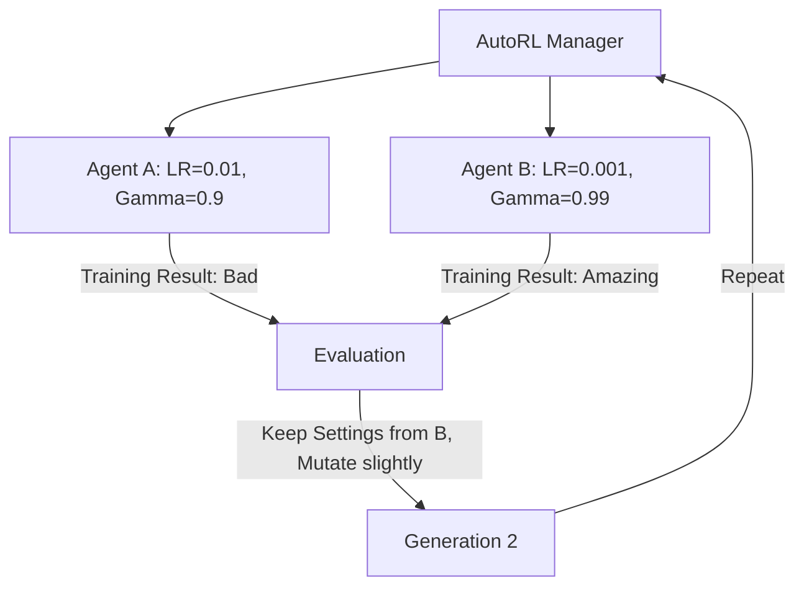

# AutoRL (Evolutionary Meta-Optimization)

🧠 **What does this do? (The Analogy)**
Think of a **Laboratory that builds Labs**. 
- A normal lab (The RL Agent) does experiments to find a cure for a disease. 
- **AutoRL** is the "Super-Lab" that experiments with the **Lab itself**. 
- It asks: "What if the lab had better microscopes (Higher resolution state)?" or "What if the scientists worked 2-hour shifts instead of 8 (Different batch sizes)?" 
By "evolving" the rules of the training process, AutoRL finds the perfect "Recipe" for learning that no human could have calculated.

🔍 **Step-by-Step Explanation:**
1. **The Search Space**: A list of every setting in the RL algorithm (Gamma, Lambda, LR, Network Layers, Activation Functions).
2. **Evolutionary Loop**: 100 different versions of the RL agent are trained simultaneously.
3. **Fitness**: The "Fitness" is the final score the agent reaches on the actual task (e.g., "Distance walked").
4. **Crossover/Mutation**: The best "Settings" are combined to create the next generation of RL agents.
5. **Benefit**: It discovers "Symbiotic" settings. For example, it might find that "A high learning rate only works if the batch size is also high."

📊 **High-Level Design (HLD)**

✅ **Why use this?**
It is the best choice for **Zero-Human-Involvement AI**. If you want an AI that can solve a brand-new task that has never been seen before, AutoRL is the "Auto-Pilot" that finds the right way to train that AI.

🌍 **Real-World Examples:**
1. **Google DeepMind**: Used AutoRL to find the "Reward Functions" that allowed their robot dog to learn to run and walk in just a few hours.
2. **Self-Driving Car Simulation**: Using AutoRL to find the best way to train cars to handle "Slippery Ice" by evolving the training parameters.
