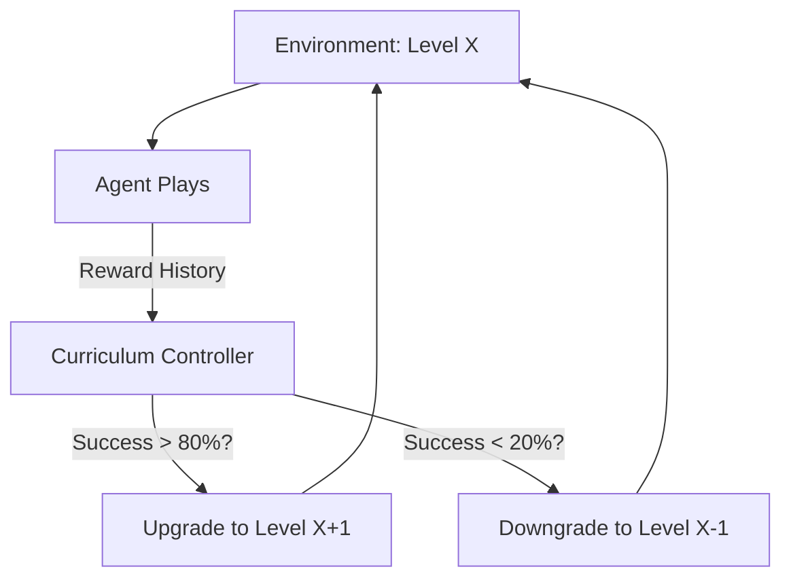

# Curriculum Learning (Scheduled Difficulty)

🧠 **What does this do? (The Analogy)**
Think of a **Person learning to play Piano**. You don't start with a complex Mozart symphony. You start with "Mary Had a Little Lamb" (Difficulty 1). Once you can play that perfectly, you move to a harder song. **Curriculum Learning** is an AI that manages its own "Sheet Music." It looks at its own performance and says: "This level is too easy, I'm bored," or "This level is too hard, I'm confused." It ensures the agent is always in the **Flow State** (Optimal Learning Zone).

🔍 **Step-by-Step Explanation:**
1. **The Staircase**: The environment has a variable "Difficulty Parameter" (e.g., speed of the ball, width of the goal).
2. **Success Monitoring**: The agent tracks its average reward over the last 100 games.
3. **The Scheduler**: 
   - If Success is **High**, increase the Difficulty.
   - If Success is **Low**, decrease the Difficulty.
4. **Benefit**: It allows AI to learn complex tasks that would be impossible to learn from scratch (e.g., a robot backflip).

📊 **High-Level Design (HLD)**

✅ **Why use this?**
It is the secret to **Training Robust Robots**. You don't just put a robot on a rocky mountain. You train it on a flat floor, then a slight ramp, then a pile of small rocks, and *then* the mountain. This "Step-by-Step" approach is 10x faster than random exploration.

🌍 **Real-World Examples:**
1. **Language Learning Apps**: AI that shows you harder words only after you have mastered the basics.
2. **Game AI Training**: Training a bot to play a strategy game by first playing against "Easy" bots and gradually moving up to "Master" bots.
