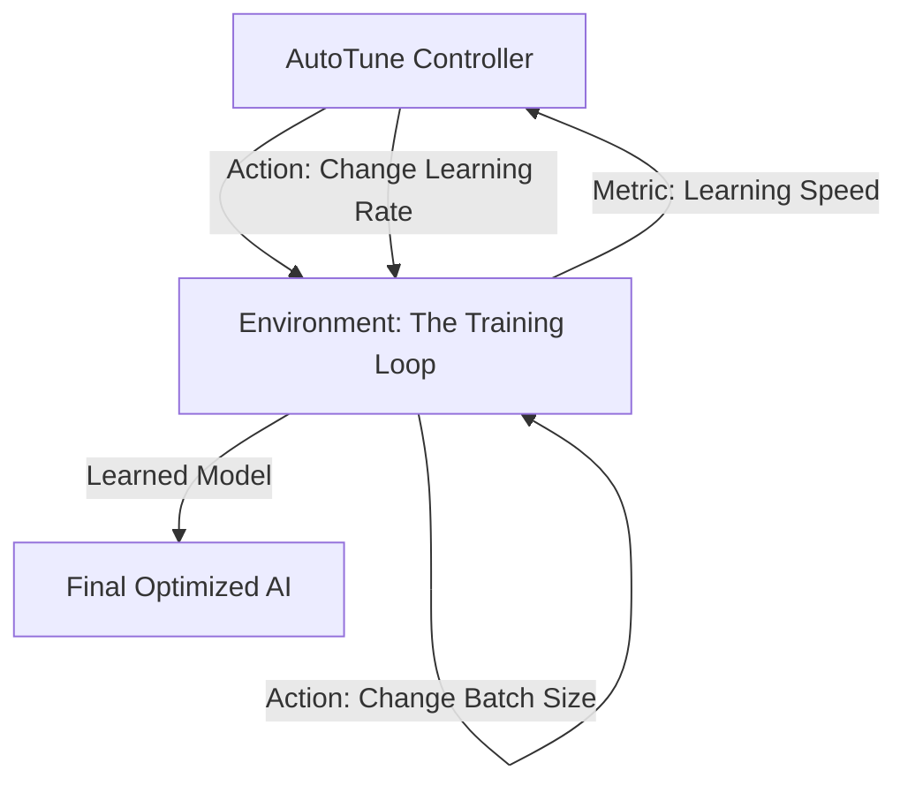

# Hyperparameter RL Tuning (AutoTune)

🧠 **What does this do? (The Analogy)**
Think of a **Person training a Dog, and a Coach training the Person**. 
- The Person (The RL Agent) is teaching the dog to sit. 
- The Coach (The AutoTuner) is watching the person and giving them advice: "You're speaking too fast, the dog is confused" (Decrease Learning Rate) or "You're not giving enough treats" (Increase Exploration). 
- **AutoTune RL** is an AI that sits "Above" your main AI. It watches the training curve and adjusts the knobs (learning rate, batch size, etc.) in real-time to ensure the main AI learns as fast as possible.

🔍 **Step-by-Step Explanation:**
1. **Meta-Action**: The "Action" is a change to a hyperparameter (e.g., $LR = LR \times 1.1$).
2. **Meta-Reward**: The reward is the **Slope** of the learning curve of the main agent.
3. **Bandit / PPO**: A small RL algorithm (like a Multi-Armed Bandit) is usually used to make these decisions.
4. **Benefit**: It removes the "Black Magic" of machine learning. You don't have to guess what the best learning rate is; the AI finds it for you.

📊 **High-Level Design (HLD)**

✅ **Why use this?**
It is the best choice for **Production ML Pipelines**. It ensures that your models are always training at "Maximum Efficiency," even if the data changes over time.

🌍 **Real-World Examples:**
1. **Google Vizier**: A system that manages thousands of ML experiments, using RL to "tune" the parameters of every single one.
2. **Online Advertising**: An AI that tunes its own "Bid Strategy" parameters in real-time as the market becomes more or less competitive.
