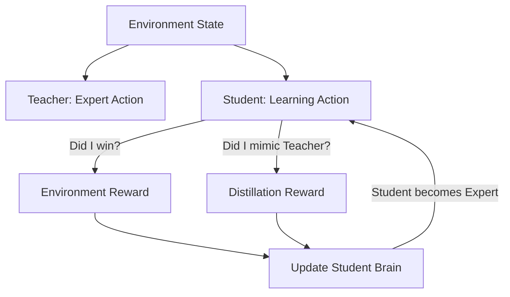

# Kickstarting RL (Student-Teacher)

🧠 **What does this do? (The Analogy)**
Think of a **Junior Surgeon observing a Senior Surgeon**. 
- The junior surgeon (The AI) is trying to learn how to operate. 
- If they just try things randomly, they will cause problems (Slow Learning). 
- **Kickstarting** allows the Junior to look at the Senior and say: "I'll try to do what they do, but I'll also try to find my own slightly better way." 
Over time, the Junior becomes just as good as the Senior, but they reach that level **10x faster** than if they were learning alone.

🔍 **Step-by-Step Explanation:**
1. **The Teacher**: A pre-trained, expert AI that already knows how to solve the task.
2. **The Student**: A fresh AI that is just starting.
3. **Cross-Entropy Loss**: The Student is rewarded for "Guessing the same thing" as the Teacher.
4. **Decaying Influence**: As the Student gets better, the weight of the "Teacher's Advice" is lowered, allowing the Student to surpass the Teacher's skill.
5. **Benefit**: It solves the "Cold Start" problem in RL where the agent spends days doing nothing but failing.

📊 **High-Level Design (HLD)**

✅ **Why use this?**
It is the standard for **Sim-to-Real Transfer**. You train an expert in a perfect simulator (The Teacher), then you use Kickstarting to train a real robot (The Student) that can handle the messiness of the real world by following the teacher's "vibe."

🌍 **Real-World Examples:**
1. **Self-Driving Cars**: Training a new AI model by using a billion hours of "Expert Human Driving" data as the Teacher.
2. **Game AI**: Training a hard "Boss" for a video game by having it "Kickstart" its learning from the previous version of the game's AI.
