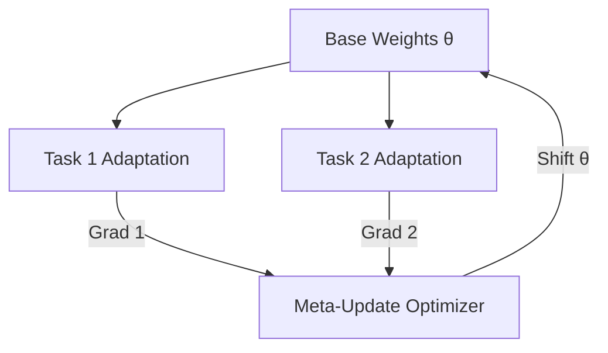

# Model-Agnostic Meta-Learning (MAML)

🧠 **What does this do? (The Analogy)**
Think of a **Generic Sports Athlete**. Standard RL is like training to be a professional Golfer. MAML is like training to have **perfect reflexes and balance**. If you have perfect balance, you can learn Golf in 1 day, Tennis in 1 day, and Soccer in 1 day. MAML doesn't learn a task; it learns the **starting point** so that any new task is just one tiny adjustment away.

🔍 **Step-by-Step Explanation:**
1. **The Meta-Initialization**: The network starts with weights $\theta$.
2. **The Task Loop**: We take Task 1 and see how $\theta$ would need to change (one gradient step) to solve it. We do the same for Task 2, 3, etc.
3. **The Meta-Update**: We update the original $\theta$ so that it moves toward the **center** of all those task-specific solutions.
4. **Fast Adaptation**: Now, if you give the agent a brand-new task, it can solve it using just **one single update**.

📊 **High-Level Design (HLD)**

✅ **Why use this?**
It is the "Gold Standard" of Meta-Learning. It works for any model (Neural Nets, CNNs, Transformers) and any task (Classification, RL, Regression). It allows AI to be versatile and adaptable.

🌍 **Real-World Examples:**
1. **Robotic Personal Assistants**: An AI that can learn a new user's specific kitchen layout and preferences after only being shown once.
2. **Adaptive Cybersecurity**: A system that can adapt to a "Zero-Day" (brand new) virus by seeing only one example and adjusting its defense strategy instantly.
