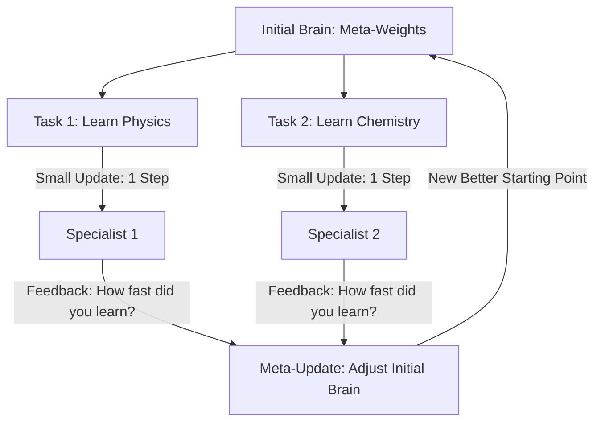

# MAML (Model-Agnostic Meta-Learning)

🧠 **What does this do? (The Analogy)**
Think of a **Musician who can learn any instrument in 5 minutes**. 
- Most people spend years learning one instrument (Standard RL). 
- **MAML** is a "Musician" who has spent their whole life practicing "The Art of Finger Movement." 
They haven't mastered the Piano or the Guitar, but they have learned exactly how to move their hands so that as soon as they pick up a Guitar, they can play perfectly after just 2 minutes of practice. MAML learns the **Initialization** that makes all future learning as fast as possible.

🔍 **Step-by-Step Explanation:**
1. **The Inner Loop**: The agent takes a few steps of experience in a new task and calculates a quick update ($\theta'$).
2. **The Outer Loop**: The agent looks at how much its performance improved in that new task. It updates its **Original Brain** ($\theta$) to ensure that next time, that improvement happens even faster.
3. **Task Agnostic**: It works for classification, regression, or reinforcement learning. It doesn't care about the task; it only cares about the **Speed of Adaptation**.
4. **Benefit**: It is the foundation of **Few-Shot Learning**. An AI trained with MAML can see a new video game and play it at a pro level after just 1 or 2 tries.

📊 **High-Level Design (HLD)**

✅ **Why use this?**
It is the gold standard for **AI Adaptability**. If you are building a robot that will be used in many different homes, you use MAML to train it so that it can "figure out" a new kitchen layout in under 60 seconds.

🌍 **Real-World Examples:**
1. **Personalized Voice Assistants**: An AI that adapts to your specific accent and vocabulary after hearing you say only 3-4 sentences.
2. **Adaptive Game AI**: An NPC that learns your fighting style during the first level and becomes your perfect rival by the second level.
