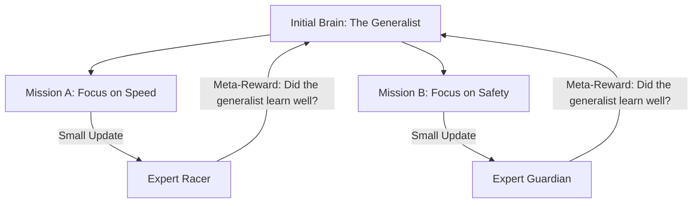

# MO-MAML (Multi-Objective Meta-Learning)

🧠 **What does this do? (The Analogy)**
Think of a **Person training to be a Decathlete**. 
- In a decathlon, you don't just need to run fast; you also need to jump high and throw far. 
- If you only practice running, you will fail the other 9 events. 
- **MO-MAML** is a "Meta-Coach." It trains the athlete so that with just **one afternoon of practice**, they can adjust their skills to win **any** specific objective (e.g., "Today we focus on high jump"). 
It creates a "Swiss Army Knife" brain that can be sharpened for any specific combination of goals instantly.

🔍 **Step-by-Step Explanation:**
1. **Multi-Objective**: The AI is given a "Vector" of rewards (e.g., $[ \text{Speed}, \text{Safety}, \text{Fuel Efficiency} ]$).
2. **Meta-Initialization**: The AI learns a starting point (Weights) that is "central" to all these goals.
3. **Task-Specific Weights**: During a real mission, the user says "Today, Safety is 90% and Speed is 10%."
4. **Fast Adaptation**: Because it used MO-MAML, the AI only needs **1 or 2 steps** of math to reach the perfect balance for that specific mission.

📊 **High-Level Design (HLD)**

✅ **Why use this?**
It is the best choice for **Customizable AI**. If you sell a robot to 100 different customers, each customer will have a different "Priority." MO-MAML allows you to ship one robot that each customer can easily "tune" for their specific needs.

🌍 **Real-World Examples:**
1. **Personalized Smart Homes**: An AI that "Meta-learns" the balance between "Comfort" and "Energy Saving" so it can quickly adapt to any individual family's preference.
2. **Autonomous Weapon Systems (Safety focus)**: Ensuring an AI can be instantly "tuned" to prioritize "Collateral Damage Prevention" over "Mission Success" depending on the situation.
