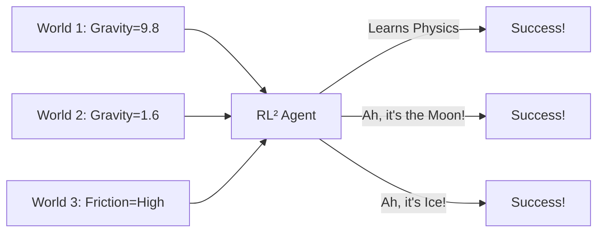

# Meta-Learning RL^2 (Learning to Learn)

🧠 **What does this do? (The Analogy)**
Think of a **Super-Student**. If you give them a Math test, they fail the first question, but they instantly realize: "Oh! This is Calculus!" and they get every other question right. If you give them a History test, they fail the first one, realize: "Oh! This is about the Roman Empire!" and adapt. **RL²** is an AI that has been trained on **1,000 different worlds**. It has learned a "Fast Learning Algorithm" inside its memory. It can enter a new world and "figure out the rules" in just 5 or 10 steps.

🔍 **Step-by-Step Explanation:**
1. **The Architecture**: It is an RNN (Recurrent Neural Network).
2. **The Input**: Every step, it receives the state, the last action, the last reward, and the "Done" signal.
3. **The Hidden State**: This is the "Brain" of the agent. Because it sees the rewards, it can "remember" which actions worked in this specific world.
4. **Benefit**: Standard RL takes 1,000,000 steps to learn. Meta-Learning RL² can learn a new task in **10 steps**.

📊 **High-Level Design (HLD)**

✅ **Why use this?**
It is the key to **General Intelligence**. Instead of building one AI for Chess and one for Go, we build one Meta-AI that can play *any* game after just a few practice moves.

🌍 **Real-World Examples:**
1. **Personalized Robots**: A robot that arrives at your house and "learns" the layout of your furniture and your specific preferences (e.g., "I like my coffee hot") in just 5 minutes.
2. **Rapid Drug Discovery**: An AI that "learns" the chemistry of a new virus and adapts its simulation to find a cure faster than a standard model.
