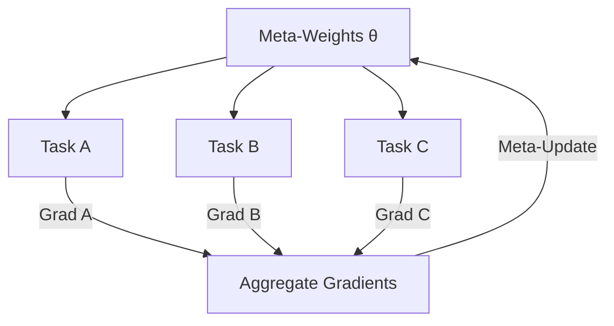

# Meta-Reinforcement Learning (Meta-RL)

🧠 **What does this do? (The Analogy)**
Think of a **Polyglot** (someone who speaks many languages). Standard RL is like learning one language from scratch. Meta-RL is like learning the **structure of languages**. Once you know how grammar and verbs work in 10 languages, you can learn the 11th language in just a few days. The agent learns the "common patterns" across many tasks so it can solve new ones instantly.

🔍 **Step-by-Step Explanation:**
1. **The Meta-Policy ($\theta$)**:
   - These are the "base weights" that aren't specific to any one task.
2. **Inner Loop (Task-Specific)**:
   - The agent tries task A, B, and C. It calculates how it should change to solve each.
3. **Outer Loop (Meta-Update)**:
   - The agent updates $\theta$ so that it is at a "perfect starting point" for any future task.
4. **Fast Adaptation**:
   - When a new task appears, the agent only needs 1 or 2 steps to become an expert.

📊 **High-Level Design (HLD)**

✅ **Why use this?**
Standard RL is slow. Meta-RL is for **Few-Shot Learning**. If you have a robot that needs to work in different houses, it shouldn't take 1000 hours to learn the layout of each new kitchen. It should adapt in 5 minutes.

🌍 **Real-World Examples:**
1. **Search & Rescue Robots**: Adapting to different types of terrain (mud, sand, ice) without needing a full re-train.
2. **Personalized Tutors**: AI that learns how a specific student learns and adapts its teaching style in minutes.
