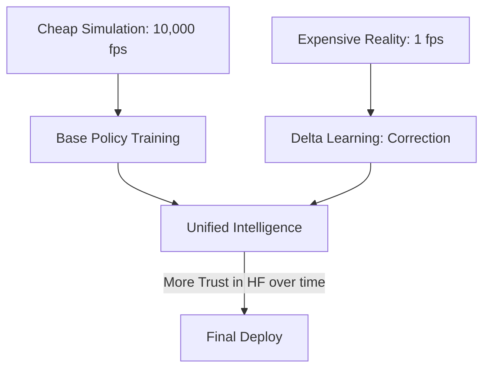

# Multi-Fidelity RL (Scaling Intelligence)

🧠 **What does this do? (The Analogy)**
Think of a **Student studying Physics**. They spend 90% of their time reading **Textbooks** (Low-Fidelity: cheap, fast, but slightly simplified). They spend only 10% of their time in a **Real Laboratory** (High-Fidelity: expensive, slow, but 100% accurate). **Multi-Fidelity RL** uses the cheap simulation to learn the "General Rules" and then uses the real world only to "Fine-tune" the details. It gives you the intelligence of a master scientist at the cost of a library card.

🔍 **Step-by-Step Explanation:**
1. **Low-Fidelity (LF)**: A very fast, simplified simulation (e.g., a "stick-figure" robot).
2. **High-Fidelity (HF)**: A slow, complex, realistic simulation (e.g., a 3D-physics robot) or real-world data.
3. **Data Fusion**: The agent trains on 1,000,000 steps of LF data to learn the basics (like "How to walk").
4. **Correction**: The agent then sees 1,000 steps of HF data and learns the **Difference** between the textbook and reality (e.g., "Oh, the floor is more slippery than the book said").
5. **Efficiency**: You get high-performance results using 99% less computation time.

📊 **High-Level Design (HLD)**

✅ **Why use this?**
It is the only way to solve **Deep-Tech Problems**. If you are designing a new Jet Engine or a Rocket, one "High-Fidelity" simulation can take 24 hours to run. You cannot do RL with that. You must use Multi-Fidelity RL to learn the basics on a "Fast" model first.

🌍 **Real-World Examples:**
1. **Aerospace Design**: Using a 1D air-flow model to learn the basics of flight and a 3D CFD model to refine the wing shape.
2. **Formula 1 Racing**: Training a driver AI on a fast video game engine and then fine-tuning it on the team's $5M professional simulator.
