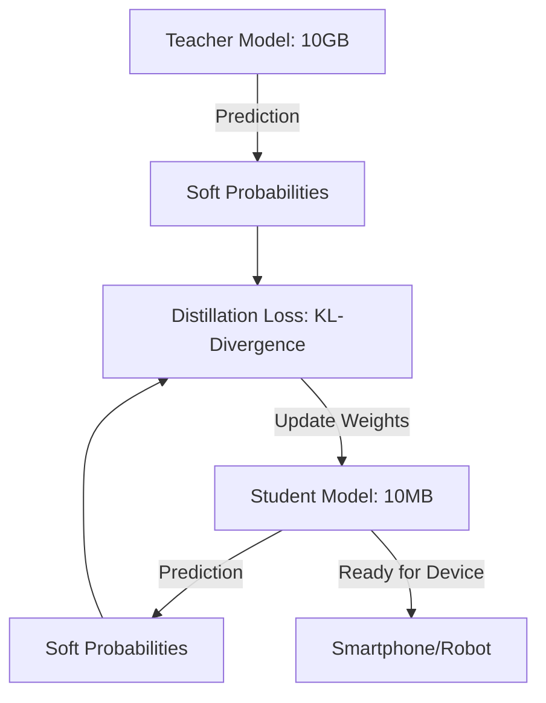

# Policy Distillation (Brain Compression)

🧠 **What does this do? (The Analogy)**
Think of a **Professor and a Student**. The Professor (Teacher) has a massive brain and can solve any problem, but they are very slow and take up a lot of space. The **Student** is small and fast. Instead of the Student learning from the real world (which is slow), the Student just tries to **Mimic the Professor**. By watching the Professor's choices, the Student learns all the wisdom in 1/10th of the time and becomes a "Mini-Master" that can fit on a smartphone.

🔍 **Step-by-Step Explanation:**
1. **The Teacher**: A large, pre-trained network (or multiple networks for different tasks).
2. **The Student**: A much smaller, simpler network.
3. **Soft Targets**: Instead of just seeing "Correct/Incorrect," the Student sees the **Probabilities** of the Teacher (e.g., "This is 90% a dog and 10% a cat"). This "Soft" information contains much more knowledge than a single label.
4. **KL-Divergence**: The loss function that forces the Student's output to match the Teacher's output as closely as possible.

📊 **High-Level Design (HLD)**

✅ **Why use this?**
It is the standard for **Mobile AI Deployment**. You train a massive model on a supercomputer server (Teacher) and then distill its knowledge into a tiny model (Student) that can run instantly on a user's phone or a low-power drone.

🌍 **Real-World Examples:**
1. **Google Translate**: The app on your phone uses a "Distilled" version of the massive translation models running in Google's data centers.
2. **Multi-Game Consoles**: Distilling 10 different agents (one for each game) into a single "Master Agent" that can play all 10 games using only 1 set of weights.
