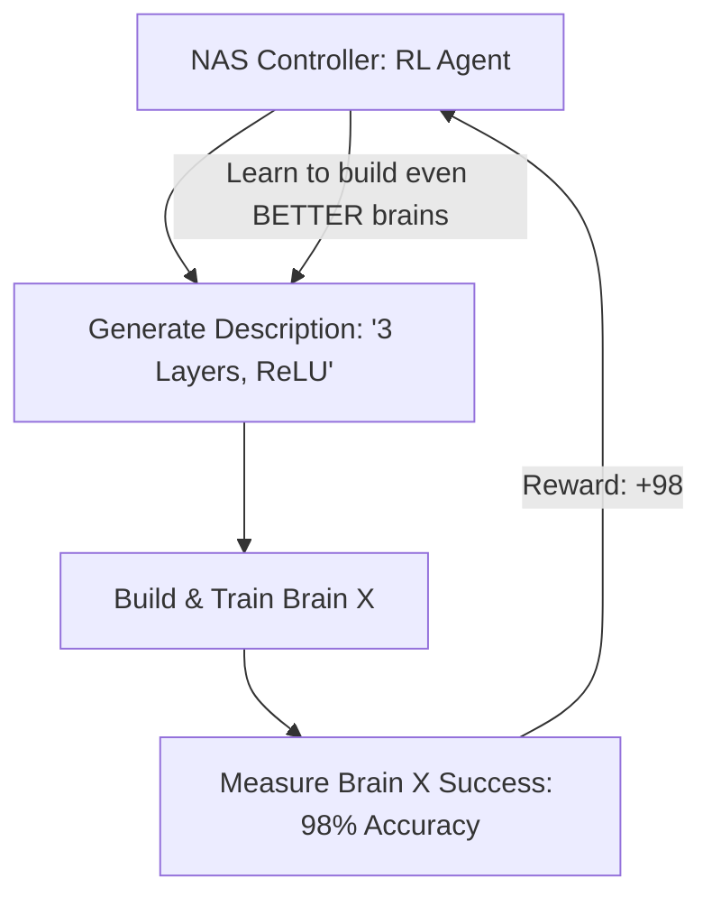

# Neural Architecture Search (NAS-RL)

🧠 **What does this do? (The Analogy)**
Think of a **Coach who builds a Robot for every sport**. 
- For Soccer, the coach builds a robot with long legs (High-speed architecture). 
- For Weightlifting, the coach builds a robot with thick arms (High-memory architecture). 
- **NAS-RL** is an AI that doesn't "Play the Game"—it **Designs the Brain** of the AI that plays the game. It explores billions of possible neural network shapes (layers, neurons, connections) to find the one that is perfectly optimized for a specific task.

🔍 **Step-by-Step Explanation:**
1. **The Controller**: An RL agent (usually an RNN) that outputs "Architecture Descriptions" as its actions.
2. **Evaluation**: The described brain is built and trained on the task for a few minutes.
3. **The Reward**: The accuracy or speed of that brain is given back to the Controller as a reward.
4. **Benefit**: It finds "Inhuman" architectures that no human programmer would ever think to try, but that are 10x faster or more efficient.

📊 **High-Level Design (HLD)**

✅ **Why use this?**
It is how **Google's AutoML** and **EfficientNet** were created. If you want the absolute most efficient AI for a mobile phone or a tiny robot chip, you use NAS-RL to "Evolutionize" the architecture.

🌍 **Real-World Examples:**
1. **Medical Imaging**: Designing a custom neural network that is 100% optimized to find cancer in X-rays using the least amount of memory.
2. **Mobile Vision**: Designing the architecture for "Face ID" or camera filters so they run instantly without draining the phone battery.
