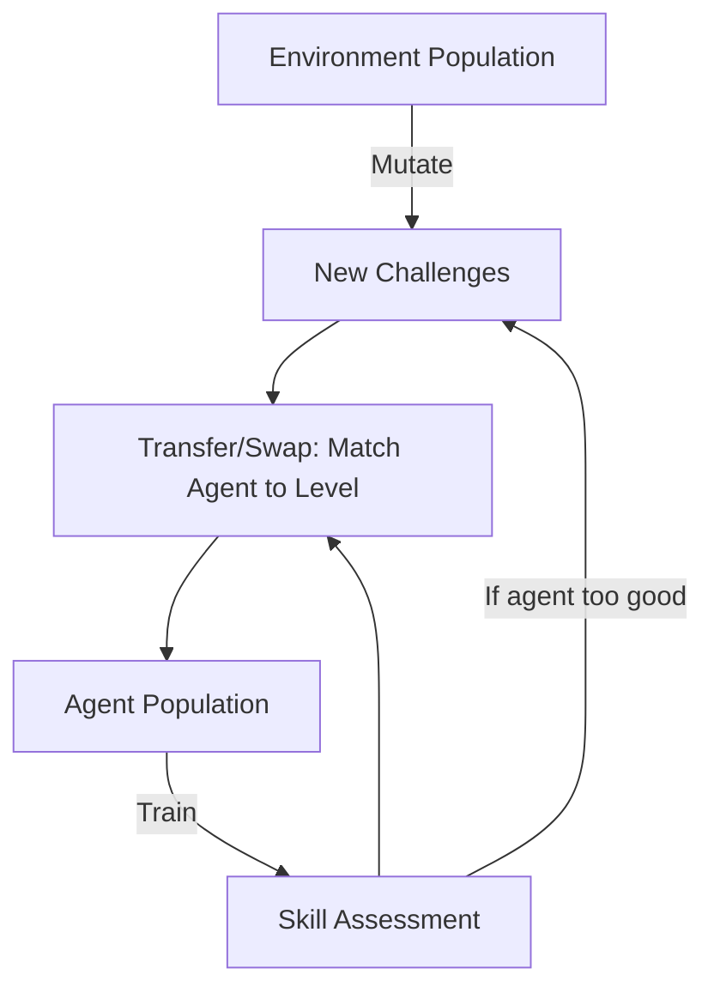

# POET (Paired Open-Ended Trailblazer)

🧠 **What does this do? (The Analogy)**
Think of a **Personal Trainer** who is also a **Mad Scientist**. The trainer doesn't just watch you run; they **rebuild the track** while you are sleeping. If you get good at running on flat ground, they add hills. If you beat the hills, they add ice. If you beat the ice, they add hurdles. **POET** evolves the **Environment** and the **Agent** together. The goal isn't just to solve one game, but to create an "Evolutionary Explosion" of skills.

🔍 **Step-by-Step Explanation:**
1. **Population of Environments**: POET maintains a set of different environments (e.g., different types of obstacle courses).
2. **Environment Evolution**: It periodically "Mutates" the environments (adding a wall here, a gap there).
3. **Agent Transfer**: If an agent is struggling in "Environment A" but would be great in "Environment B," POET **Swaps** them.
4. **Curriculum Discovery**: Instead of a human designing levels, the AI discovers its own "Path of Learning."

📊 **High-Level Design (HLD)**

✅ **Why use this?**
It is the foundation of **Open-Ended AI**. It can learn to solve complex walking tasks that are impossible for standard RL because the "End Goal" is too far away. By building its own staircase of challenges, it reaches heights that no human-designed curriculum could.

🌍 **Real-World Examples:**
1. **Autonomous Off-Road Driving**: Evolving different types of mud, sand, and rock terrains to train a vehicle that can handle any possible landscape on Earth.
2. **Procedural Level Generation**: Used in games to create levels that are "Perfectly Difficult" for the player's current skill level.
