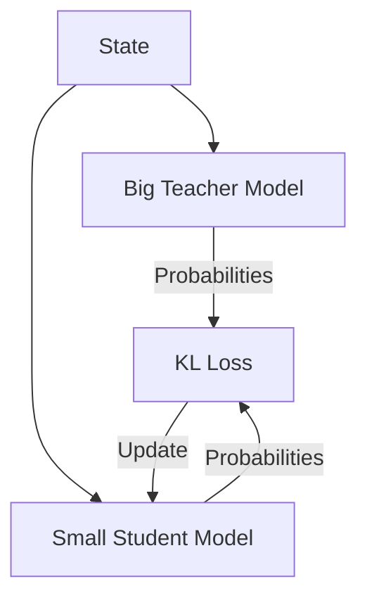

# Policy Distillation

🧠 **What does this do? (The Analogy)**
Think of a **Professor and a Student**. The Professor (**Teacher**) is a massive, complex AI that knows everything but is too slow and heavy to run on a phone. The Student (**Student**) is a tiny, fast AI. Instead of the student learning from the environment (which is hard), the student just tries to **mimic the Professor's answers**. By the end, the student becomes almost as smart as the professor but stays small and fast.

🔍 **Step-by-Step Explanation:**
1. **The Teacher**: A pre-trained, high-performance model (e.g., a massive Rainbow DQN or a huge Transformer).
2. **The Student**: A much smaller neural network.
3. **KL-Divergence**: The loss function that measures how different the Student's "reasoning" is from the Teacher's.
4. **Dark Knowledge**: The student doesn't just learn the *right* answer; it learns the *probabilities* of all answers. For example, if the teacher says "Action A is 70% good and B is 25% good," the student learns that B is the next-best alternative.

📊 **High-Level Design (HLD)**

✅ **Why use this?**
It is the standard way to deploy AI on **Edge Devices** (Phones, IoT, Drones). You train a monster model in a data center, distill it into a tiny model, and ship that tiny model to the device.

🌍 **Real-World Examples:**
1. **Smartphone Camera AI**: Distilling a massive image-processing RL model into a tiny chip that can run in real-time on your phone.
2. **Autonomous Drones**: Training a heavy simulation model and distilling it into a lightweight controller that fits on the drone's limited hardware.
