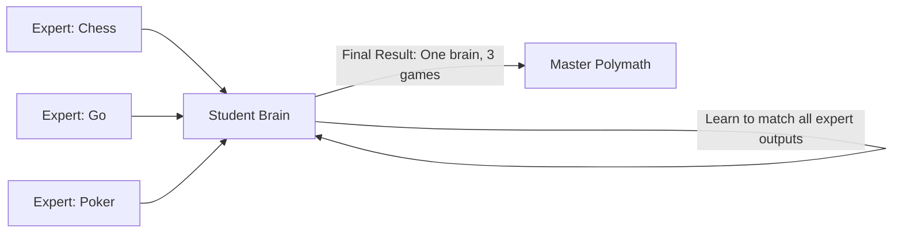

# Policy Distillation (Multi-Task Scaling)

🧠 **What does this do? (The Analogy)**
Think of a **Student studying for 5 different exams simultaneously**. 
- They have 5 private tutors. Tutor 1 is a Math expert, Tutor 2 is a History expert, etc. 
- The Student (The AI) doesn't have time to read all 5 textbooks. 
- Instead, the tutors "Tell" the student their conclusions (Distillation). 
- The student learns to "mimic" the wisdom of all 5 tutors at once. 
By the end, the student is a "Polymath" who is 80% as good as all 5 experts, but only has **one brain** instead of 5.

🔍 **Step-by-Step Explanation:**
1. **The Experts**: Pre-train $N$ separate models on $N$ separate tasks (e.g., 5 different Atari games).
2. **The Student**: A fresh neural network that tries to play all $N$ tasks.
3. **KL Divergence**: The Student is punished if its "Probability of Action" is different from the Expert's probability for that specific task.
4. **Benefit**: It produces a **Generalist AI**. It is the most common way to put "Large" AIs onto "Small" devices (like putting a ChatGPT-sized brain into a smartphone).

📊 **High-Level Design (HLD)**

✅ **Why use this?**
It is the best choice for **Model Compression and Efficiency**. If you have 50 different AI features in your app, you don't want 50 different 1GB models. You use Distillation to compress them all into one 1GB model that can do everything.

🌍 **Real-World Examples:**
1. **Virtual Assistants**: Distilling separate models for "Voice Recognition," "Translation," and "Intent Detection" into a single efficient brain for Siri or Alexa.
2. **Video Games**: Distilling 100 different "NPC Personalities" into a single neural network that can act like any character depending on its input.
