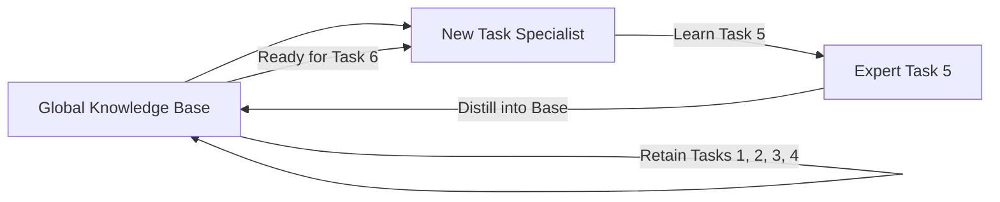

# Progress and Compress (Continual Learning)

🧠 **What does this do? (The Analogy)**
Think of a **Musician learning to play 10 different instruments**. 
- **Progress**: They spend 1 week focused only on the Violin. They become an expert (The Progress Phase). 
- **Compress**: They take the patterns they learned on the Violin (the rhythm, the notes) and store them in their "General Musical Brain" (The Compress Phase). 
- Then, they move to the Piano. Because they already have the "General Musical Brain," they learn the Piano much faster. 
**Progress and Compress** allows an AI to learn Task A, then Task B, then Task C, without ever "Forgetting" how to do Task A.

🔍 **Step-by-Step Explanation:**
1. **Knowledge Base**: A central neural network that holds everything the AI has ever learned.
2. **Active Column**: A separate network that focuses only on the current new task.
3. **Distillation**: Once the Active Column is an expert, its knowledge is "compressed" into the Knowledge Base using EWC (Elastic Weight Consolidation) or simple distillation.
4. **Benefit**: It solves **Catastrophic Forgetting**. Standard AI usually "erases" Task A to make room for Task B. P&C ensures Task A is safe forever.

📊 **High-Level Design (HLD)**

✅ **Why use this?**
It is the standard for **Lifelong AI**. If you want an AI that gets smarter every day for 10 years, you need a "Progress and Compress" architecture to manage its growing library of skills.

🌍 **Real-World Examples:**
1. **Personalized Medical Bots**: An AI that learns from every patient it treats, "compressing" the rare diseases it sees into its global knowledge base to help future patients.
2. **Multi-Game AI**: A single AI that can play every game on the Atari console by learning them one by one.
