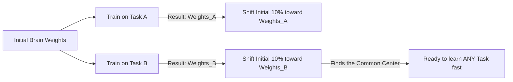

# Reptile Meta-Learning

🧠 **What does this do? (The Analogy)**
Think of a **Pathfinder in the forest**. 
1. They want to find a starting point that is close to **every** cabin in the woods. 
2. They walk to Cabin A, then turn around and take **two steps** back toward where they started. 
3. Then they walk to Cabin B, and take **two steps** back. 
**Reptile** is a "Meta-Learning" hiker. By moving slightly toward the "Expert" weights of every individual task, the AI eventually finds a "Perfect Center" starting point. If you start from this point, you can reach any cabin (master any task) in just 1 or 2 steps.

🔍 **Step-by-Step Explanation:**
1. **Task Sample**: Pick a random task (e.g., "Walk Left").
2. **Standard Learning**: Train the agent on that task for 10 steps to get "Task Weights."
3. **The Meta-Step**: Move the **Original** weights 10% toward the Task Weights.
4. **Benefit**: It is 100x simpler than MAML because it doesn't need "Gradients of Gradients" (Second-order math). You just do standard learning and then a simple average.

📊 **High-Level Design (HLD)**

✅ **Why use this?**
It is the most **Scalable Meta-Learning** algorithm. If you have a massive neural network (like a LLM), MAML is too slow and memory-heavy. Reptile is fast, efficient, and works almost as well.

🌍 **Real-World Examples:**
1. **Adaptive Image Recognition**: A camera that learns to recognize your specific pets and family members after seeing them only once or twice.
2. **Manufacturing Robots**: A robot that can be moved from a "Welding" task to a "Painting" task and adapt its motor controls in 30 seconds.
