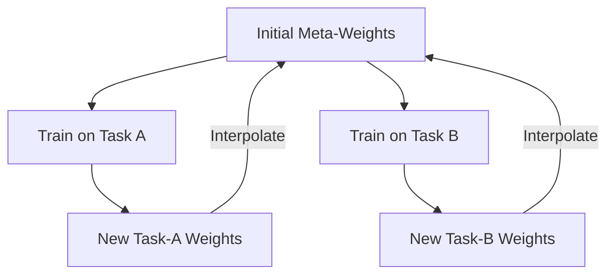

# Reptile (Simple Meta-Learning)

🧠 **What does this do? (The Analogy)**
Think of a **Musician** who wants to learn to play any song by ear. Standard Meta-RL (MAML) is like a musician who studies the sheet music of 100 songs to find the common patterns. **Reptile** is like a musician who just tries to play Song A for an hour, then tries Song B for an hour, and after each session, they slightly adjust their **"Default Finger Position"** to be closer to what they just played. Over time, their hands naturally rest in a position that makes playing *any* song much easier.

🔍 **Step-by-Step Explanation:**
1. **The Starting Weights ($\Phi$)**: The meta-parameters the agent starts with.
2. **Task Training**: Pick a random task (e.g., Task 1) and train on it for 10 steps to get new weights $W_1$.
3. **The Reptile Step**: Move the starting weights $\Phi$ slightly toward $W_1$.
4. **Repeat**: Do this for Task 2, Task 3, etc.
5. **The Result**: The starting weights $\Phi$ settle into a "central hub" from which any specific task can be reached in just 1 or 2 steps.

📊 **High-Level Design (HLD)**

✅ **Why use this?**
It is **much simpler** than other Meta-RL algorithms like MAML. It doesn't require calculating second-order derivatives (Hessians), which makes it faster and more memory-efficient while achieving almost the same performance.

🌍 **Real-World Examples:**
1. **Edge Device Calibration**: Training a "Base Model" for a sensor that can be quickly calibrated to any specific factory environment in seconds.
2. **Recommendation Warm-start**: An AI that can learn a new user's preferences after they only like 2 or 3 items, because it was trained to be at a "perfect starting point" for all users.
