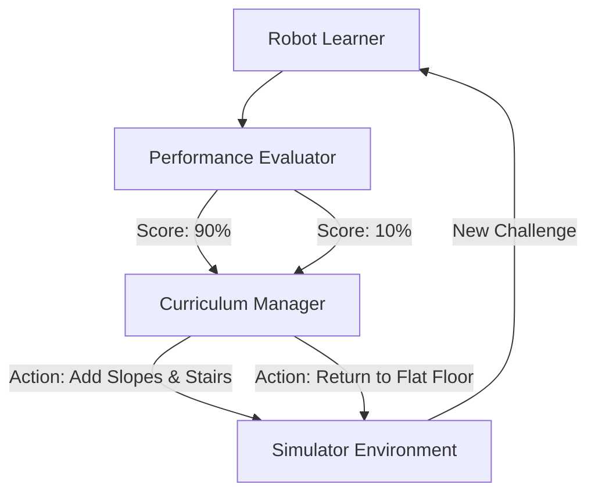

# Robot Walk Curriculum RL

🧠 **What does this do? (The Analogy)**
Think of a **Baby learning to walk**. You don't put a baby on a treadmill at 10mph on their first day. 
1. **Level 1**: Learning to stand still on a flat floor. 
2. **Level 2**: Walking on a flat floor. 
3. **Level 3**: Walking on grass. 
4. **Level 4**: Walking up a hill. 
**Curriculum RL** is a "Teacher AI" that manages the "Student AI." It makes the environment just a little bit harder every time the robot succeeds, ensuring it is always challenged but never overwhelmed.

🔍 **Step-by-Step Explanation:**
1. **The State**: The success rate of the agent in the last 100 attempts.
2. **The Reward**: The speed of learning. We want the agent to learn as fast as possible.
3. **The Action**: Change the environment parameters (e.g., add wind, make the floor slippery, or add obstacles).
4. **The "Goldilocks Zone"**: The curriculum aims for the "Zone of Proximal Development"—not too easy (boredom) and not too hard (frustration).

📊 **High-Level Design (HLD)**

✅ **Why use this?**
Without a curriculum, complex robots (like Humanoids) will **never learn to walk**. The chance of randomly moving your 20 joints correctly to walk on stairs is essentially zero. You must "guide" the AI through small steps of success.

🌍 **Real-World Examples:**
1. **ANYmal Robotics**: Training a four-legged robot to walk in snowy forests by first training it in a perfectly flat digital room.
2. **OpenAI Rubik's Cube**: Training a robot hand to solve a Rubik's cube by starting with a cube that only needs one turn to solve.
