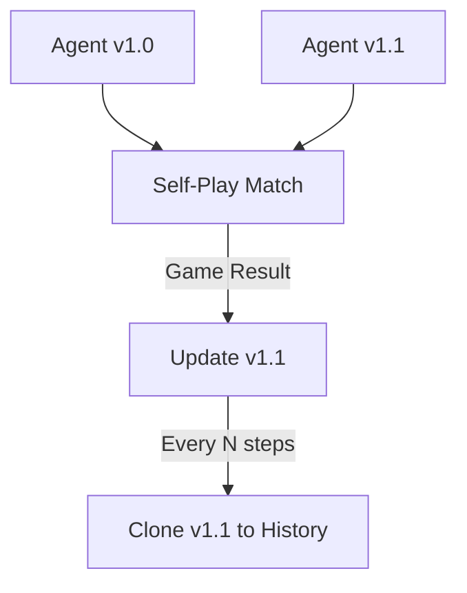

# Self-Play Reinforcement Learning

🧠 **What does this do? (The Analogy)**
Think of a **Martial Artist** who practices in front of a mirror. They try a punch, then they imagine how they would block that punch. Then they try a faster punch to get past that block. Because they are playing against themselves, the "opponent" is always exactly as good as they are. They create a **Perfect Training Partner** that grows stronger as they do.

🔍 **Step-by-Step Explanation:**
1. **Agent Cloning**: The current best version of the agent is copied to a "History Buffer."
2. **The Match**: The agent plays a game (Chess, Poker, Dota) against one of its older versions.
3. **Reward**: If the current agent wins, it gets a reward. If it loses, it learns how to beat that older strategy.
4. **Curriculum**: This creates an "Automatic Curriculum." The agent never gets bored because the competition is always challenging.

📊 **High-Level Design (HLD)**

✅ **Why use this?**
It is the secret behind the world's best AI like **AlphaGo** and **OpenAI Five**. It allows agents to discover strategies that humans have never even thought of, because they aren't limited by watching human data.

🌍 **Real-World Examples:**
1. **Cybersecurity**: Training an AI "Hacker" and an AI "Defender" to play against each other to find vulnerabilities in a network.
2. **Competitive Gaming**: Training bots for complex games like Dota 2 or StarCraft where human experts are not enough to provide a challenge.
