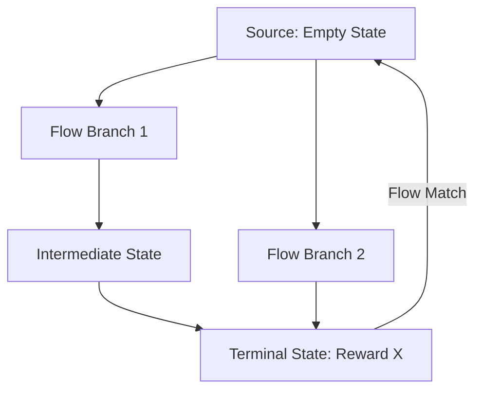

# GFlowNets (Generative Flow Networks)

🧠 **What does this do? (The Analogy)**
Think of a **Sewer System** or a **River Network**. Water flows from the source to the ocean. **GFlowNets** treat "Reward" as the "Ocean." The agent learns a "Flow" through different paths. If a specific path leads to a massive reward, the AI ensures a lot of "water" (probability) flows that way. Crucially, it doesn't just find the *one* best path; it finds **every** path that leads to a reward, proportional to how good the reward is.

🔍 **Step-by-Step Explanation:**
1. **Diversity over Optimality**: Standard RL (like DQN) finds the single best solution. GFlowNets find a **diverse set** of good solutions.
2. **Flow Matching**: The agent ensures that the amount of "Flow" entering a state equals the amount of "Flow" leaving it.
3. **Terminal Reward**: At the very end of a trajectory, the "Flow" must equal the "Reward."
4. **Sampling**: By following the flow, you can sample complex objects (like molecules or code) with a probability that perfectly matches their "value."

📊 **High-Level Design (HLD)**

✅ **Why use this?**
It is the current "Hot Topic" in AI for **Drug Discovery**. In chemistry, you don't just want the "best" molecule; you want 100 *different* molecules that might all work as a drug. GFlowNets are better at this than any standard RL algorithm.

🌍 **Real-World Examples:**
1. **Antibiotic Discovery**: Generating thousands of diverse molecular structures that might kill a specific bacteria, rather than just finding one "super-molecule."
2. **Architecture Search**: Generating diverse neural network designs that all perform well, allowing engineers to pick the one that fits their hardware best.
