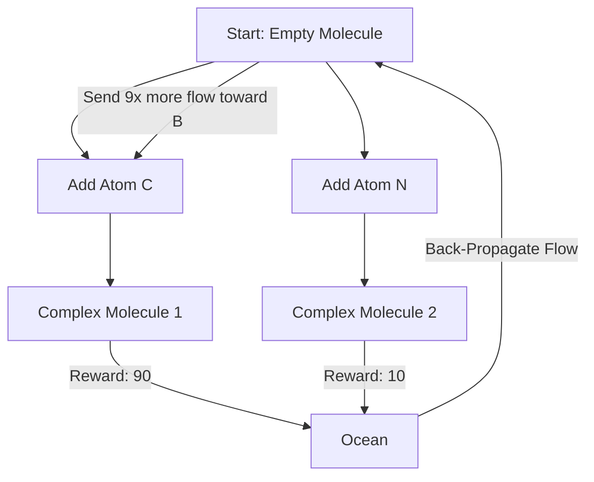

# GFlowNets (Generative Flow Networks)

🧠 **What does this do? (The Analogy)**
Think of a **River System flowing into the Ocean**. 
- The **Water (Flow)** starts at the mountains (Empty State) and flows through many branches. 
- At the end, the water reaches the **Ocean (Rewards)**. 
- Some parts of the ocean are deep (High Reward), and some are shallow (Low Reward). 
- **GFlowNets** ensure that the amount of water flowing into a specific part of the ocean is **exactly proportional** to how deep it is. 
This is a new way to "Sample" things. Instead of finding the "One Best Move," GFlowNets find **All Good Moves** and pick between them fairly. It is the secret to **AI Creativity**.

🔍 **Step-by-Step Explanation:**
1. **Flow Consistency**: The amount of "Probability" flowing into a state must equal the amount flowing out.
2. **Diversity**: Unlike standard RL, which often gets stuck on one "perfect" solution, GFlowNets explore every possible way to get a reward.
3. **Probabilistic Generation**: It is used to "construct" objects (like molecules or code) step-by-step.
4. **Benefit**: It is much better at **Scientific Discovery** because it doesn't just find one drug that works—it finds 1,000 different drugs that work.

📊 **High-Level Design (HLD)**

✅ **Why use this?**
It is the gold standard for **Generative Science**. It was invented by **Yoshua Bengio** to solve the problem of "Discovery." If you want to find new materials, new drugs, or new mathematical proofs, GFlowNets are the most powerful tool.

🌍 **Real-World Examples:**
1. **Drug Discovery**: Generating millions of different molecular structures that all have the "Intent" of curing a specific disease.
2. **Architecture Design**: Exploring 10,000 different building shapes that all satisfy the "Reward" of being stable and cheap to build.
3. **Silicon Chip Layout**: Finding many different ways to arrange transistors that all result in a fast, low-heat chip.
