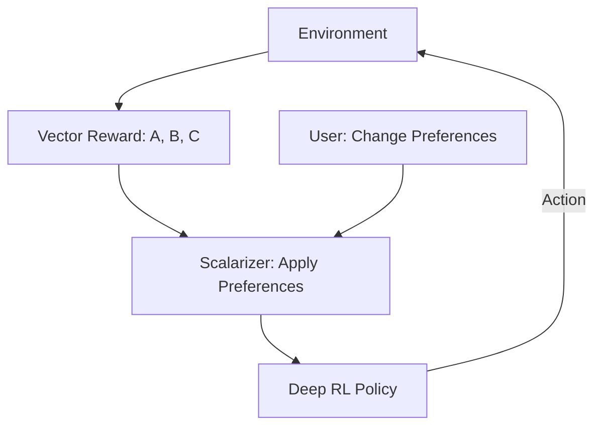

# Multi-Objective Pareto Optimization RL

🧠 **What does this do? (The Analogy)**
Think of a **Car Buyer**. They want a car that is **Fast**, **Cheap**, and **Safe**. But usually, if it's fast and safe, it's not cheap. There is no "Perfect Car"—only a **Trade-off**. **Multi-Objective RL** is an AI that doesn't just look for one score. It looks for the **Pareto Front**—the set of all "Best Possible Trade-offs." It allows a human to say: "Today, I care more about speed," or "Today, I care more about money," and the AI adapts its strategy instantly.

🔍 **Step-by-Step Explanation:**
1. **The Vector Reward**: Instead of a single number (e.g., 10 points), the agent receives a list: $[R_{speed}, R_{energy}, R_{safety}]$.
2. **Preference Weights**: A vector that defines what the user cares about right now (e.g., $[0.1, 0.9]$ means "90% energy saving").
3. **Scalarization**: Converting the vector into a single number to update the neural network.
4. **Pareto Optimality**: Finding a strategy where you **cannot improve one goal without hurting another**.

📊 **High-Level Design (HLD)**

✅ **Why use this?**
In the real world, **Nothing is a single goal**. If you optimize a factory only for speed, you might break the machines. Multi-objective RL allows engineers to balance competing priorities mathematically.

🌍 **Real-World Examples:**
1. **Autonomous Racing**: Balancing "Lap Time" vs. "Tire Wear" vs. "Fuel Consumption."
2. **Network Routing**: Balancing "Low Latency" vs. "High Throughput" vs. "Packet Loss."
3. **Investment Planning**: Balancing "High Profit" vs. "Low Risk."
