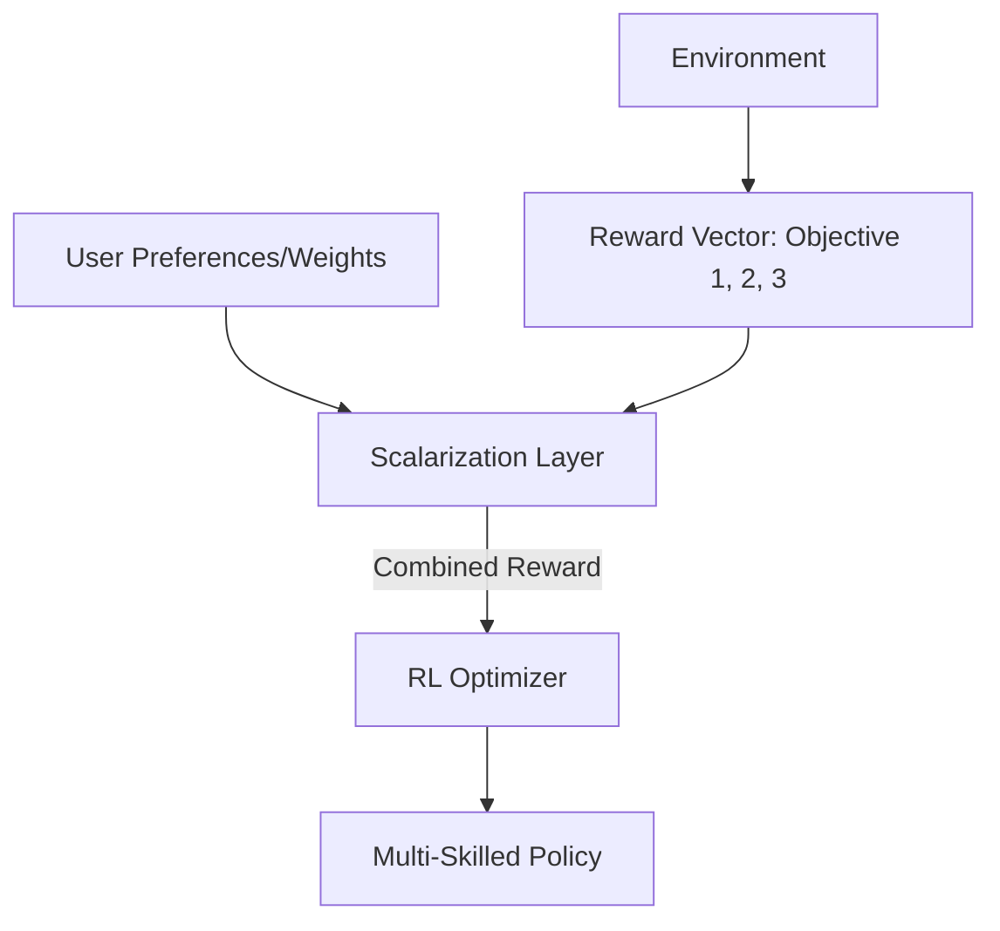

# Multi-Objective Reinforcement Learning (MORL)

🧠 **What does this do? (The Analogy)**
Think of a **Car Buyer**. They want a car that is **Fast**, **Cheap**, and **Safe**. You can't have the "best" of all three at once. If you want it faster, it gets more expensive. If you want it cheaper, it might be less safe. **MORL** doesn't find one "best" answer; it finds the **Pareto Front**—a menu of the best possible trade-offs. The agent learns how to be "The Fastest Safe Car" or "The Cheapest Safe Car" depending on what the user asks for.

🔍 **Step-by-Step Explanation:**
1. **Reward Vector**: Instead of a single number, the environment returns a list of rewards (e.g., $[+10 \text{ points}, -2 \text{ fuel}, -1 \text{ wear}]$).
2. **Preferences**: The user provides a "Weight Vector" that tells the AI which goals are currently most important.
3. **Pareto Optimality**: An action is "Pareto Optimal" if you cannot improve one objective without making another one worse.
4. **Scalarization**: The most common way to solve this is by multiplying the rewards by the preferences to get a single number for training.

📊 **High-Level Design (HLD)**

✅ **Why use this?**
Real-world problems are **never** about just one thing. A company wants to maximize profit *and* employee happiness *and* sustainability. MORL allows you to train a single agent that can balance these conflicting interests dynamically.

🌍 **Real-World Examples:**
1. **Sustainable Agriculture**: An AI that balances Crop Yield (Objective 1) with Water Conservation (Objective 2) and Soil Health (Objective 3).
2. **Autonomous Taxi**: Balancing "Getting the passenger there fast" (Speed) with "Driving smoothly" (Comfort) and "Saving electricity" (Efficiency).
