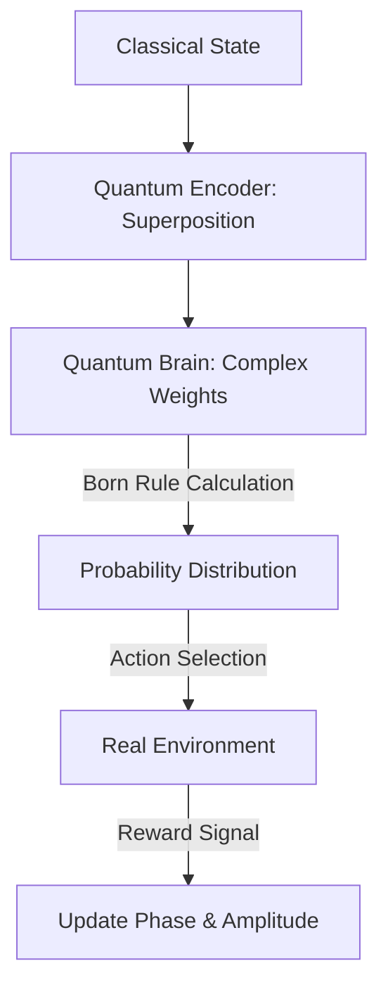

# Quantum RL (Theoretical Superposition)

🧠 **What does this do? (The Analogy)**
Think of a **Ghost that can be in 100 places at once**. 
- Standard RL (Classical) is a human who has to walk into a room to see if there is treasure there. 
- **Quantum RL** is a "Quantum Ghost." The ghost doesn't pick one room. Instead, it exists in a **Superposition** of all rooms simultaneously. 
- When the ghost "Observes" the environment (The Collapse), it is mathematically most likely to appear in the room with the treasure. 
By representing the AI's brain using **Complex Amplitudes**, the AI can "Explore" millions of paths at the same time using the laws of physics.

🔍 **Step-by-Step Explanation:**
1. **The Qubit Policy**: Instead of probabilities, the policy uses complex numbers $(\alpha + i\beta)$.
2. **Superposition**: The AI maintains a state that represents "Doing Action A AND Action B" at the same time.
3. **The Born Rule**: To actually move, the AI "Collapses" its brain. The probability of an action is the square of its amplitude $| \psi |^2$.
4. **Benefit**: In theory, Quantum RL can solve problems with "Exponentially Large" state spaces (like breaking encryption or simulating proteins) in a fraction of the time.

📊 **High-Level Design (HLD)**

✅ **Why use this?**
It is the **Absolute Frontier** of AI. While we don't have large quantum computers yet, researchers use "Quantum-Inspired" algorithms on normal computers to solve massive optimization problems that standard RL can't touch.

🌍 **Real-World Examples:**
1. **Quantum Chemistry**: Using RL to find the "Ground State" of a molecule by simulating the quantum interactions.
2. **Optimization in Finance**: Finding the "Optimal Portfolio" among trillions of combinations by treating the market as a quantum system.
