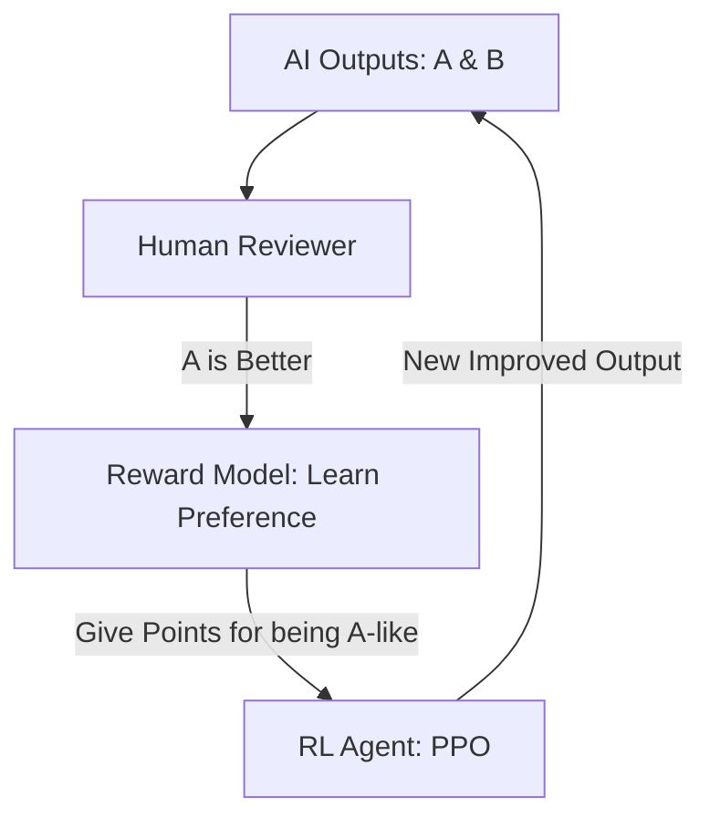

# RLHF (Reinforcement Learning from Human Feedback)

🧠 **What does this do? (The Analogy)**
Think of a **Puppy learning to sit**. The puppy doesn't know what "Points" are. It only knows that when it sits, the human smiles and gives a treat. **RLHF** is how we train AI to be "Polite" and "Helpful." Instead of a mathematical score, a human looks at two AI answers and says: "I like Answer A better than Answer B." The AI then builds a **Reward Model** that acts as a "Digital Human" to train the main AI.

🔍 **Step-by-Step Explanation:**
1. **Pre-training**: The AI learns the basics of language or movement from a massive dataset.
2. **Human Ranking**: A human is shown two different outputs from the AI and ranks them (e.g., "A is safer than B").
3. **Reward Model (RM)**: A separate AI learns to predict what the human would say. It becomes a mathematical "Opinion Machine."
4. **Proximal Policy Optimization (PPO)**: The main AI is then trained using this Reward Model as its "Environment." It learns to maximize "Human Happiness."

📊 **High-Level Design (HLD)**

✅ **Why use this?**
It is the **Secret Sauce** behind **ChatGPT**, **Claude**, and **Gemini**. Without RLHF, AI is just a "Next-Word Predictor." With RLHF, it becomes an assistant that understands safety, humor, and helpfulness.

🌍 **Real-World Examples:**
1. **Chatbots**: Training an AI to avoid toxic language and be helpful to users.
2. **Creative Writing AI**: Learning the "Style" of a specific author by having that author rank different story drafts.
