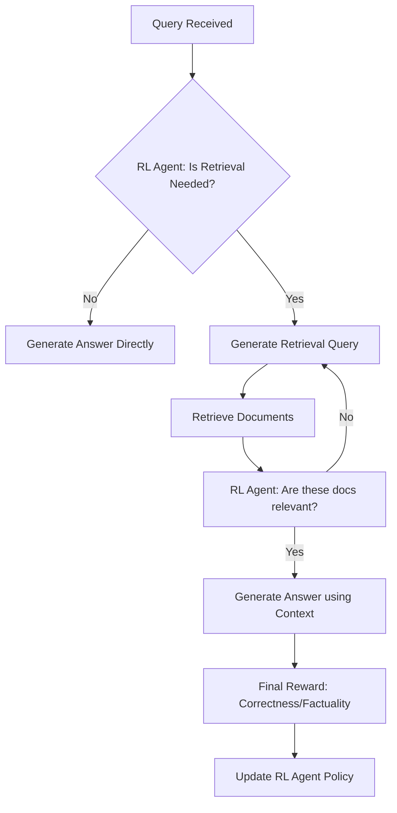

# RL-Optimized Retrieval-Augmented Generation (RAG)

## Introduction
While standard RAG simply retrieves documents and feeds them to an LLM, **RL-Optimized RAG** uses Reinforcement Learning to decide **when** to retrieve, **what** to retrieve, and **how** to use the retrieved info to maximize accuracy and minimize costs.

## Core Concepts

### 1. Adaptive Retrieval
Instead of retrieving for every query, an RL agent learns to predict if retrieval is necessary. If the LLM already knows the answer, it skips retrieval to save time/money.

### 2. Multi-Step Reasoning
The agent can decide to retrieve multiple times, using the information from the first retrieval to refine the second search query.

### 3. Feedback Loop
The system receives rewards based on the final answer's correctness (e.g., from a human or a factual checker) and uses that reward to improve its retrieval strategy.

## High-Level Design (HLD)

## Why RL-RAG is Better?
- **Precision**: Only retrieves when necessary, reducing noise in the prompt.
- **Cost-Efficiency**: Reduces API calls to vector databases and LLMs.
- **Factuality**: Explicitly trained to prioritize factual retrieval over hallucinations.

### Pros and Cons
| Pros | Cons |
| :--- | :--- |
| Dramatically reduces hallucinations | Very high latency (due to agent reasoning) |
| Saves cost on large-scale systems | Hard to collect training data for rewards |
| Handles complex, multi-hop queries | Much more complex than standard RAG |

---

## Interview Questions (Q&A)

**Q: How can RL help in a RAG pipeline?**
A: RL can optimize the "Retriever" by learning to rank documents better based on the "Generator's" actual performance, or it can optimize the "Router" to decide if retrieval is needed at all.

**Q: What is a good reward signal for RL-RAG?**
A: A combination of: 1) Faithfulness (is the answer in the docs?), 2) Relevancy (does it answer the query?), and 3) Conciseness (was it done in minimal steps?).

**Q: What algorithms are used for RL-RAG?**
A: Usually **PPO** or **DPO**, as the state space (text) is extremely high-dimensional and requires stable policy optimization.

## 🛠️ Minimal Implementation Overview
The provided code demonstrates an **Adaptive Retrieval** agent:
- **Environment**: A set of "Easy" (Known) and "Hard" (Unknown) questions.
- **Reward**: High for correct answers, but with a **penalty cost** for using retrieval.
- **Goal**: The agent learns to answer "Easy" questions directly to save costs and use "RAG" only for "Hard" questions.

### Files:
- `core.py`: The Q-learning logic and RAG environment.
- `run_demo.py`: A demonstration script showing the learned strategy.
