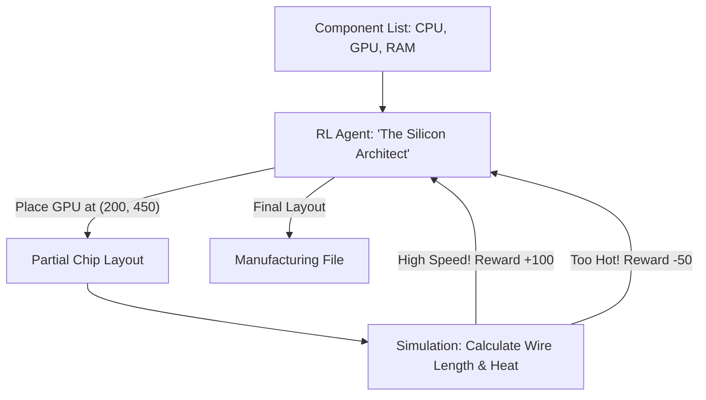

# RL for Chip Floorplanning (SOTA Silicon Design)

🧠 **What does this do? (The Analogy)**
Think of a **City Architect trying to fit 10 million buildings into a tiny 1-mile square**. 
- They have to make sure the "Traffic" (The Wires) between buildings is as short as possible so cars (Data) don't get stuck in traffic. 
- **RL for Chip Floorplanning** is the AI that designed the latest **Google TPU** and **Mobile Chips**. 
- It treats the chip like a board game. It "Places" components (RAM, CPU cores, Cache) on the silicon and is rewarded if the total wire length is short and the chip is small. 
It can do in **6 hours** what used to take human engineers **6 months**.

🔍 **Step-by-Step Explanation:**
1. **Graph Representation**: The chip is treated as a graph where components are nodes and wires are edges.
2. **Sequential Placement**: The AI places one macro-block at a time, looking at the "Congestion" of the wires.
3. **Reward**: A combination of "Wire-Length" (Speed), "Area" (Cost), and "Congestion" (Heat).
4. **Benefit**: It finds "Strange" but efficient layouts that human engineers would never think of, resulting in chips that are 10% faster and use 10% less power.

📊 **High-Level Design (HLD)**

✅ **Why use this?**
It is the current **Industry Record Holder**. If you are building high-performance hardware, RL is now the "standard tool" for layout. It is the reason why AI hardware is evolving so much faster than traditional hardware.

🌍 **Real-World Examples:**
1. **Google TPU v4**: The entire layout of Google's most powerful AI chip was designed by an RL agent.
2. **Mobile Processor Design**: Optimizing the layout of phone chips to make them thinner and extend battery life.
3. **Data Center Networking**: Planning the layout of thousands of cables in a server room to minimize signal delay.
