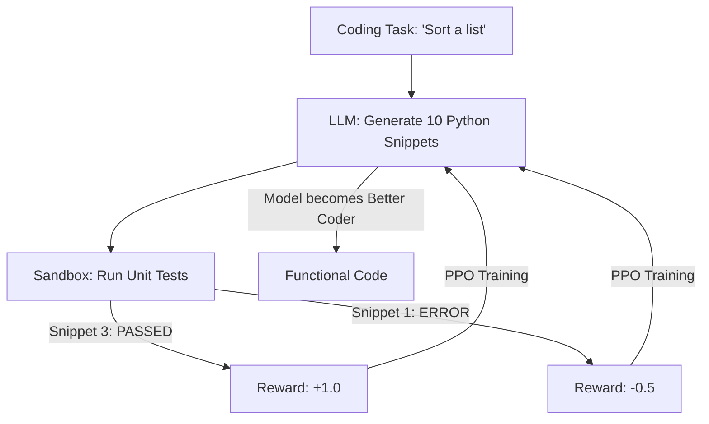

# RL for Code Generation (LLM Tuning)

🧠 **What does this do? (The Analogy)**
Think of a **Student trying to solve a Math Problem**. 
- They have a textbook (The Pre-training data). 
- They can write down any answer they want. 
- But they also have an **Answer Key** (The Unit Tests). 
- Every time they get a problem right, they get a "Gold Star" (The Reward). 
- **RL for Code Generation** is how models like **GitHub Copilot** or **GPT-4** are refined. They generate 100 versions of a program, run them all through a compiler, and only learn from the ones that actually work. It turns the model from a "Storyteller" into a "Problem Solver."

🔍 **Step-by-Step Explanation:**
1. **Sampling**: The LLM generates multiple "Candidate" code snippets.
2. **Execution**: The code is run in a secure sandbox against a battery of unit tests.
3. **Reward Signal**: If the code compiles and passes tests, it gets a high reward. If it has a bug, it gets a penalty.
4. **PPO Update**: The model's weights are updated to make the "working" code more likely in the future.
5. **Benefit**: It solves the "Hallucination" problem. The AI learns that it doesn't matter how "pretty" the code looks; it only matters if it executes correctly.

📊 **High-Level Design (HLD)**

✅ **Why use this?**
It is the gold standard for **AI Software Engineering**. It ensures that the AI's suggestions are not just "grammatically correct Python" but actually solve the user's request without bugs.

🌍 **Real-World Examples:**
1. **Automated Bug Fixing**: An AI that "plays a game" where the goal is to edit a piece of broken code until the tests pass.
2. **Smart Contract Auditing**: Using RL to find "vulnerabilities" in blockchain code by rewarding the AI for finding ways to "break" the contract's rules.
