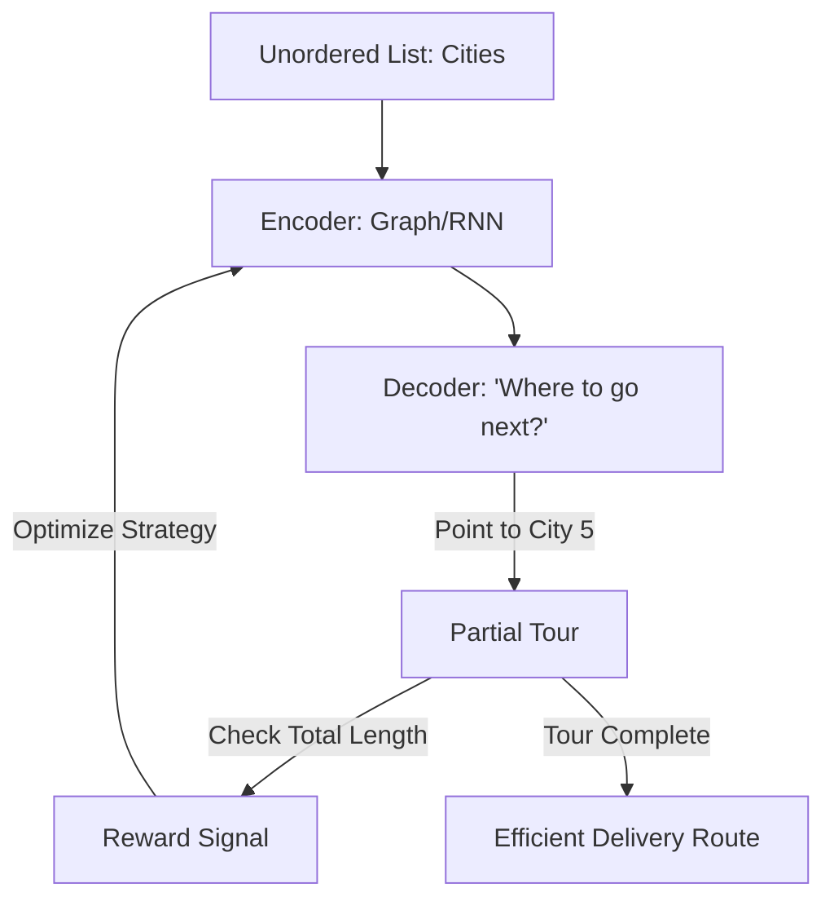

# RL for Combinatorial Optimization (Solving NP-Hard Problems)

🧠 **What does this do? (The Analogy)**
Think of a **Postman trying to deliver 100 letters using the least amount of gas**. 
- They have a map of 100 houses. 
- There are more possible routes than there are atoms in the universe. 
- **Combinatorial RL** is an AI that treats the "Map" as a game. 
- The AI "Walks" from house to house, and is rewarded if the total path is short. 
- Over time, the AI learns a **General Strategy** (like "always go to the closest neighbor first") that works for **any** map, not just the one it was trained on.

🔍 **Step-by-Step Explanation:**
1. **Pointer Networks**: A special type of neural network that can "point" to items in a list (like a list of cities).
2. **Sequential Decisions**: The agent builds a solution one step at a time (e.g., picking the next city in the tour).
3. **Reward**: The negative of the cost (e.g., distance, time, or money).
4. **Benefit**: Unlike standard math solvers (like Gurobi), an RL solver is **Near-Instant**. Once trained, it can solve a 100-city map in milliseconds.

📊 **High-Level Design (HLD)**

✅ **Why use this?**
It is the best choice for **Real-Time Logistics**. If you are Amazon or Uber, and you need to recalculate thousands of routes every second as new orders come in, you can't wait for a slow math solver. You use RL.

🌍 **Real-World Examples:**
1. **Warehouse Robot Picking**: Deciding the best order for a robot to visit 50 shelves to collect items for an order.
2. **Circuit Board Design**: Planning the paths of billions of microscopic wires on a computer chip to minimize heat and maximize speed.
3. **Ride-Sharing Dispatch**: Matching 1,000 drivers to 1,000 riders to minimize the total wait time across the whole city.
