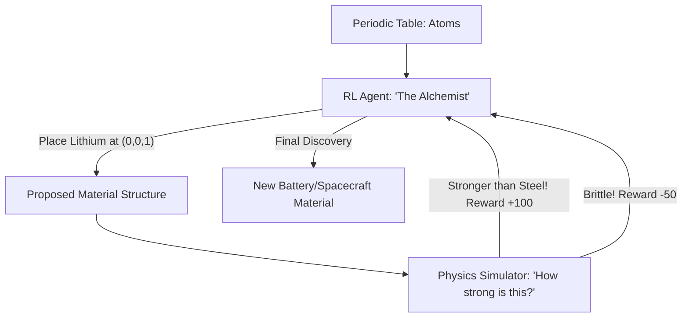

# RL for Materials Science (Discovery AI)

🧠 **What does this do? (The Analogy)**
Think of a **Chef trying to invent a new type of super-strong bread**. 
- They have 100 different types of flour and seeds (The Periodic Table). 
- **RL for Materials Science** is an AI that "Plays a Game" where the goal is to build a **Crystal Lattice** that is stronger than steel but lighter than aluminum. 
- It puts atoms of Iron, Carbon, and Titanium together in millions of different "Arrangements" (The Game Moves) until it finds a pattern that is perfectly stable.

🔍 **Step-by-Step Explanation:**
1. **The Lattice**: A repeating pattern of atoms in 3D space.
2. **Generative Model**: An AI (often a GNN) that suggests where to put the next atom.
3. **Simulation (DFT)**: A physics engine that calculates the "Strength" or "Conductivity" of the suggested material.
4. **The Reward**: A high score for any material that beats current world records (e.g., "Most Heat Resistant").
5. **Benefit**: It can discover new metals and plastics in days that would take humans 100 years of trial-and-error in a lab.

📊 **High-Level Design (HLD)**

✅ **Why use this?**
It is the gold standard for **Green Energy and Space Travel**. If we want better batteries or faster spaceships, we need materials that don't exist yet. RL is the only tool fast enough to find them.

🌍 **Real-World Examples:**
1. **Solid-State Batteries**: Using RL to find a "Solid Electrolyte" that won't catch fire and holds 10x more charge than current phone batteries.
2. **Aerospace Alloys**: Discovering a new metal for jet engines that can withstand 2,000 degrees without melting.
