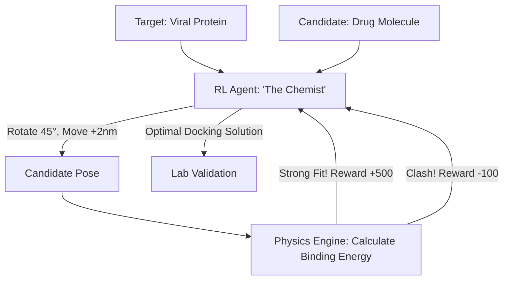

# RL for Molecular Docking (Drug Discovery)

🧠 **What does this do? (The Analogy)**
Think of a **Person trying to fit a 3D Puzzle Piece into a Lock that is constantly vibrating**. 
- The Lock (The Protein) is inside a human cell. 
- The Puzzle Piece (The Drug/Ligand) must fit perfectly into the "Active Site" to turn the lock and cure the disease. 
- **RL for Molecular Docking** is an AI that "Plays a Game" where the goal is to rotate and move the drug molecule until it clicks into place. 
- It is rewarded for **Strong Binding** (high attraction) and penalized for **Steric Clashes** (atoms trying to occupy the same space). 
It allows us to test **billions of drugs** in a computer before ever trying one in a real lab.

🔍 **Step-by-Step Explanation:**
1. **Pose Prediction**: The AI predicts the 6D position and orientation (X, Y, Z, Pitch, Yaw, Roll) of the drug relative to the protein.
2. **Conformational Search**: The AI also "twists" the internal bonds of the drug to find the best shape for fitting.
3. **Reward Function**: Based on physics (Van der Waals forces, Hydrogen bonds, and Electrostatics).
4. **Benefit**: It is **1,000x faster** than traditional "Autodock" software. It allows scientists to "Screen" the entire chemical universe to find a cure for a new virus in days.

📊 **High-Level Design (HLD)**

✅ **Why use this?**
It is the gold standard for **Modern Pharmacology**. During the COVID-19 pandemic, RL-based docking was used to find existing drugs that could be repurposed to block the virus. It is the core of "Digital Biology."

🌍 **Real-World Examples:**
1. **Insilico Medicine**: The first company to take a drug designed entirely by AI into human clinical trials.
2. **AutoDock-GPU with RL**: Using reinforcement learning to accelerate the search for cancer-fighting molecules.
3. **Antibiotic Discovery**: Finding new molecules that can "dock" into bacteria and kill them without harming human cells.
