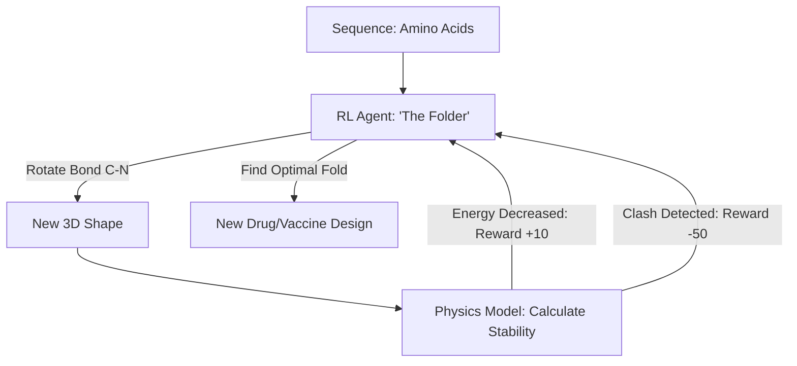

# RL for Protein Folding (Structural AI)

🧠 **What does this do? (The Analogy)**
Think of a **Knotted Ball of Yarn**. 
- To understand how the yarn works, you need to untangle it and see where every string goes. 
- A protein is like a string of amino acids that "folds" into a 3D shape. 
- **RL for Protein Folding** is an AI that plays a "Game" where the pieces are atoms. 
- The AI is rewarded if it moves the atoms into a shape that is **Stable and Low-Energy**. 
- Once we know the shape, we can design **Medicine** that fits into that shape like a key in a lock.

🔍 **Step-by-Step Explanation:**
1. **The State**: The 3D coordinates $(x,y,z)$ of every atom in the protein.
2. **The Actions**: Moving an atom or twisting a molecular bond.
3. **The Reward**: The negative of the "Gibbs Free Energy." If the shape is natural and stable, the energy is low and the reward is high.
4. **Benefit**: It solves one of the "Holy Grails" of biology. It allows us to predict the shape of any protein in minutes instead of months in a lab.

📊 **High-Level Design (HLD)**

✅ **Why use this?**
It is the logic behind **AlphaFold**. It has revolutionized biology, allowing researchers to study COVID-19, Malaria, and Cancer at the atomic level with unprecedented speed.

🌍 **Real-World Examples:**
1. **Vaccine Development**: Designing a protein that "sticks" to a virus and blocks it from entering human cells.
2. **Plastic-Eating Enzymes**: Designing a new type of protein that can break down plastic bottles into water and CO2.
