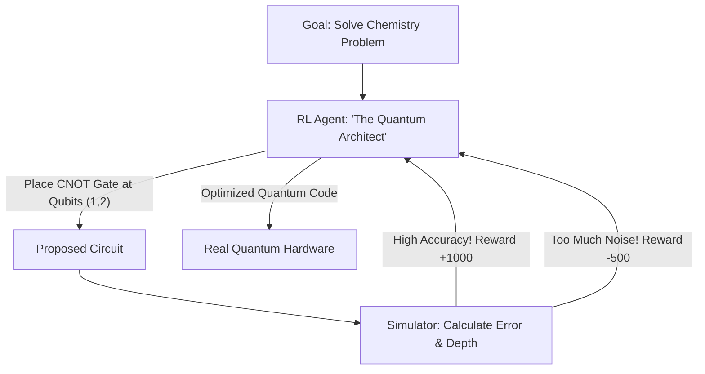

# RL for Quantum Circuit Architecture (Logical Synthesis)

🧠 **What does this do? (The Analogy)**
Think of a **Person trying to write a complex Computer Program using only 10 lines of code**. 
- In Quantum Computing, every line of code (A Gate) is "Noisy." 
- If the program is too long, the computer "forgets" what it was doing (Decoherence). 
- **RL for Quantum Circuit Architecture** is the AI that finds the **Shortest possible way** to solve a problem. 
- It treats the "Circuit" like a puzzle. It places "Quantum Gates" and is rewarded if the final circuit is **Fast** and **Accurate**. 
It is the only way to make today's small, noisy quantum computers do useful work.

🔍 **Step-by-Step Explanation:**
1. **Gate Synthesis**: The AI takes a mathematical goal (a Unitary Matrix) and tries to build it using physical gates (Hadamard, CNOT).
2. **Noise Awareness**: The AI learns that certain gates are more "reliable" than others.
3. **The Reward**: Based on "Fidelity" (how close the result is to the truth) and "Depth" (how long it takes).
4. **Benefit**: It discovers "Shortcuts." RL can often find a circuit that is 50% shorter than what a human expert would design, effectively making the quantum computer 2x more powerful.

📊 **High-Level Design (HLD)**

✅ **Why use this?**
It is the best choice for **Near-Term Quantum (NISQ)**. Until we have perfect "fault-tolerant" quantum computers, we need RL to "squeeze" every bit of performance out of the messy, noisy machines we have today.

🌍 **Real-World Examples:**
1. **Google Quantum AI**: Using RL to optimize the "Control Pulses" that move atoms inside their Sycamore processor.
2. **IBM Qiskit**: Integrating AI-based "Transpilers" that find the best way to run an algorithm on a specific chip layout.
3. **Rigetti Computing**: Using RL to solve "Combinatorial Problems" like traveling salesman by designing custom circuits.
