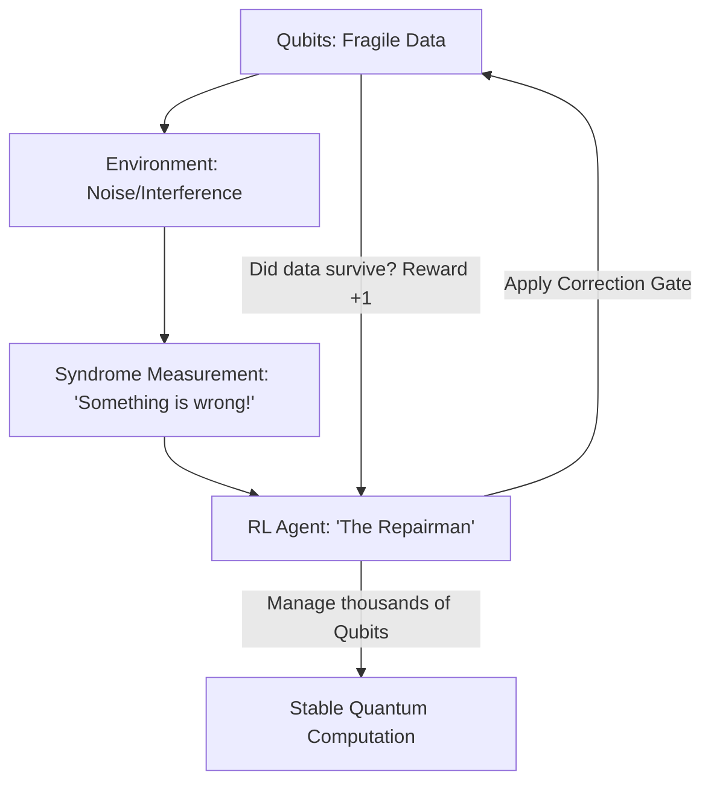

# RL for Quantum Error Correction (QEC)

🧠 **What does this do? (The Analogy)**
Think of a **Person trying to balance a spinning plate on a stick while standing on a moving train**. 
- The plate (The Qubit) is very fragile and wants to fall (Decoherence/Error). 
- The person can't look at the plate directly (because that would break the quantum state), but they can feel the "wobble" of the stick (The Syndrome). 
- **RL for QEC** is the "Balance Muscle Memory." The AI learns exactly how to flick the stick to stop the wobble before the plate falls. It manages the "Noise" of the universe so we can build a working Quantum Computer.

🔍 **Step-by-Step Explanation:**
1. **The Syndrome**: A measurement that reveals that an error *happened*, but doesn't tell us exactly *what* the error was.
2. **The Recovery**: The agent must pick a "Gate" (a quantum operation) to undo the damage.
3. **The Threshold**: If the AI fixes the error faster than the universe creates new errors, we have a stable Quantum Computer.
4. **Benefit**: Quantum noise is complex and "non-linear." RL is much better at finding patterns in this noise than traditional math-based decoders.

📊 **High-Level Design (HLD)**

✅ **Why use this?**
It is a **Critical Enabler** for the future of computing. Without Error Correction, Quantum Computers are just "Random Noise Generators." RL is the best way to design "Surface Codes" that keep qubits alive for long enough to do useful work.

🌍 **Real-World Examples:**
1. **Google & IBM Quantum Labs**: Using RL to optimize the "Calibration" of their quantum chips every morning.
2. **Quantum Networking**: Using RL to manage the "repeater" stations that send quantum signals across long distances through fiber optics.
