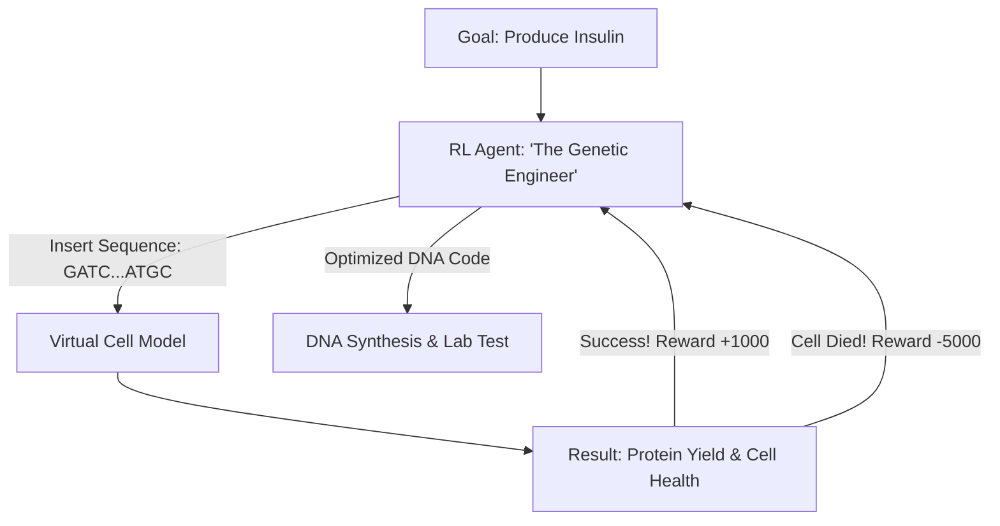

# RL for Synthetic Biology (Life Engineering)

🧠 **What does this do? (The Analogy)**
Think of a **Software Programmer trying to write a computer program that runs on a Water-based Computer**. 
- The "Code" is **DNA** (A, T, C, G). 
- The "Computer" is a **Human Cell**. 
- **RL for Synthetic Biology** is an AI that "Plays a Game" where the goal is to write a DNA sequence that makes the cell do something useful—like produce insulin or glow in the dark when it detects cancer. 
It treats the "Genetic Code" as a language and uses RL to find the "Sentences" that results in the most healthy and productive cells.

🔍 **Step-by-Step Explanation:**
1. **Gene Design**: The AI suggests a sequence of promoters, genes, and terminators.
2. **Expression Prediction**: A neural network (trained on millions of real biology experiments) predicts how much "Protein" that DNA will produce.
3. **The Reward**: Based on the goal (e.g., "Max production of Bio-fuel" or "Lowest toxicity").
4. **Benefit**: Biology is "Noisy" and "Non-linear." RL is much better at finding patterns in the chaos of a cell than human scientists, who often rely on simple "rules of thumb."

📊 **High-Level Design (HLD)**

✅ **Why use this?**
It is the best choice for **Bio-Manufacturing**. If you want to use bacteria to create "Sustainable Plastic" or "New Medicines," RL is the "Compiler" that turns your ideas into working DNA.

🌍 **Real-World Examples:**
1. **Ginkgo Bioworks**: Using AI to design custom microbes for industrial fragrance and food production.
2. **mRNA Vaccine Design**: Using RL to find the most "stable" version of an mRNA sequence so it can survive longer in the human body.
3. **Cancer Immunotherapy**: Designing "T-Cells" that are programmed with RL-designed DNA to specifically attack a patient's tumor.
