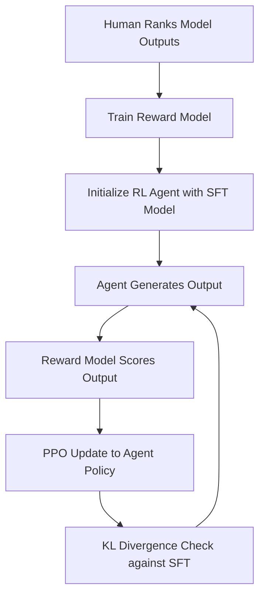

# Reinforcement Learning from Human Feedback (RLHF) Deep Dive

## Introduction
RLHF is the technology behind the "alignment" of Large Language Models (LLMs) like ChatGPT, Claude, and Gemini. It allows us to train AI systems using human preferences rather than just hard-coded reward functions.

## Core Concepts

### 1. Pre-training & SFT
The model is first trained on a massive dataset (Pre-training) and then fine-tuned on high-quality examples (Supervised Fine-Tuning or SFT).

### 2. Reward Modeling
Since human feedback is expensive, we train a **Reward Model (RM)** to predict what a human would like. Humans rank different AI outputs, and the RM learns to score them.

### 3. Optimization (PPO)
Once we have the Reward Model, we use it as the "teacher" for a Reinforcement Learning loop (usually PPO) to fine-tune the LLM.

## High-Level Design (HLD)

## Why RLHF is Better?
- **Alignment**: Ensures the AI is helpful, honest, and harmless.
- **Subjectivity**: Can handle tasks where a "mathematical" reward is impossible (e.g., "Write a funny joke").
- **Safety**: Helps in filtering out toxic or biased content.

### Pros and Cons
| Pros | Cons |
| :--- | :--- |
| Aligns AI with human values | Extremely expensive (requires human experts) |
| Handles complex, non-mathematical goals | Can lead to "Reward Hacking" (model tells you what you want to hear) |
| Critical for modern LLMs | Hard to implement correctly |

---

## Interview Questions (Q&A)

**Q: What is "Reward Hacking" in RLHF?**
A: It's when the model finds a way to get a high score from the Reward Model without actually following the human's intent (e.g., using specific words that humans tend to rate highly).

**Q: Why do we use KL Divergence in RLHF?**
A: We use a KL penalty to ensure the RL-tuned model doesn't drift too far from the original SFT model. This prevents the model from becoming "unstable" or losing its general language capabilities.

**Q: Can we do RLHF without PPO?**
A: Yes, newer methods like **DPO (Direct Preference Optimization)** are becoming popular as they don't require a separate Reward Model or PPO loop.

---
*Created for Reinforcement Learning RLHF Learning Path.*
