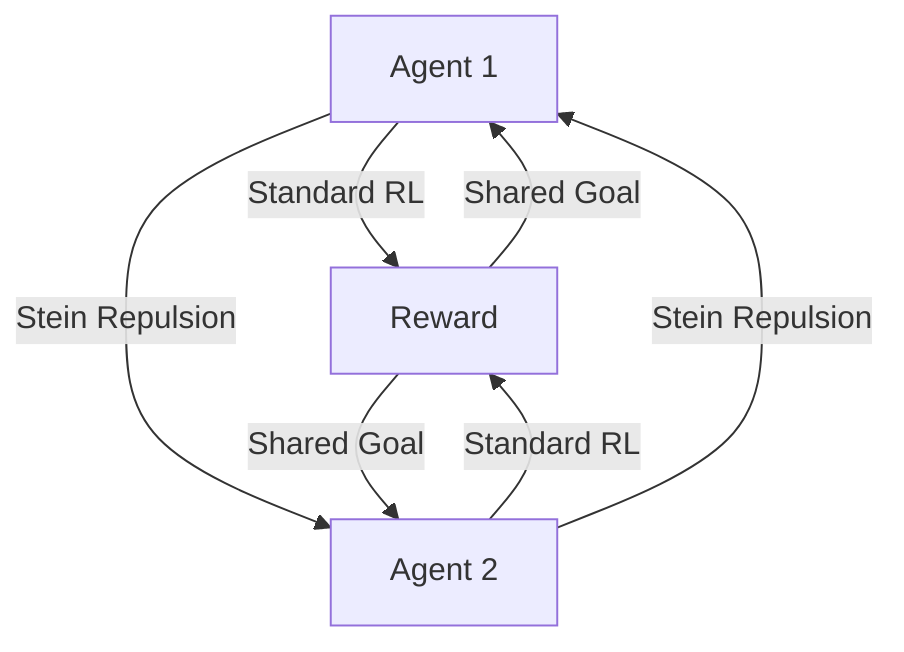

# Stein Variational Diverse RL (SVPG)

🧠 **What does this do? (The Analogy)**
Think of a **Team of Explorers** in a jungle. If they all walk in a single line, they only see one small path. **SVPG** is like giving each explorer a "Personal Space" magnetic force. The magnets **push them away** from each other. They all want to find the treasure (Reward), but they also want to stay as far away from their teammates as possible. This ensures the entire team explores the *whole* jungle simultaneously.

🔍 **Step-by-Step Explanation:**
1. **The Population**: Instead of one agent, we train a fleet of $N$ agents.
2. **The Gradient**: Each agent moves toward higher rewards (Standard RL).
3. **The Stein Force**: A special mathematical term acts as a "repulsive force" between agents.
4. **Diversity**: If two agents start doing the same thing, the Stein force pushes them to try different strategies.
5. **The Result**: You end up with a set of "Specialist" agents that have discovered every possible way to solve the task.

📊 **High-Level Design (HLD)**

✅ **Why use this?**
It solves the "Local Minimum" problem. If there are two ways to solve a game (one easy, one hard but better), standard RL might only find the easy one. SVPG ensures at least one agent will be pushed toward the harder, better path.

🌍 **Real-World Examples:**
1. **Robotic Path Planning**: Training a fleet of drones to find five different ways to enter a building so they aren't all blocked by a single closed door.
2. **Financial Hedging**: Training several trading bots that use completely different strategies so that if one fails, the others (being diverse) will likely succeed.
