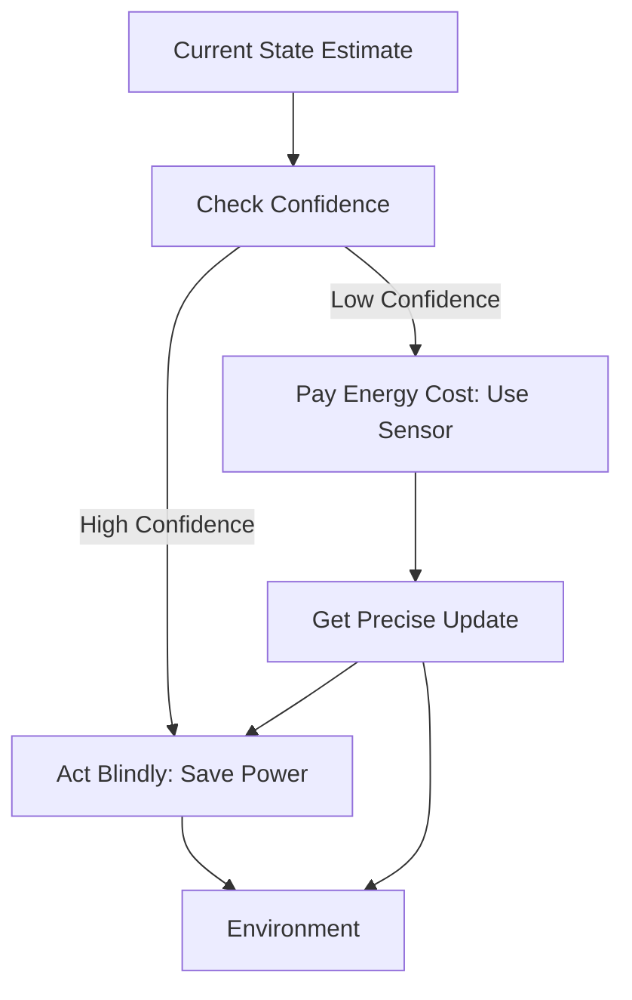

# Active Sensing (Energy-Efficient RL)

🧠 **What does this do? (The Analogy)**
Think of a **Hiker with a flashlight** at night. If the trail is straight and clear, they keep the flashlight **OFF** to save battery. If they reach a fork in the road or a dangerous cliff, they turn the flashlight **ON** to see exactly where they are. **Active Sensing** is an AI that learns to "Open its eyes" only when it is confused or in a dangerous situation. This allows robots and smart devices to last 10x longer on a single battery.

🔍 **Step-by-Step Explanation:**
1. **The Cost of Vision**: Every time the AI looks at a camera or LiDAR, it costs **Energy** (a negative reward).
2. **Uncertainty Estimation**: The agent maintains a "Confidence Score" about its current state.
3. **The Policy**: The agent chooses between:
   - **Action A**: Move without looking.
   - **Action B**: Pay the energy cost, Look, and then move.
4. **The Benefit**: The AI learns to "Blink"—it ignores the world when it's easy and pays attention when it's hard.

📊 **High-Level Design (HLD)**

✅ **Why use this?**
It is critical for **IoT (Internet of Things)** and **Space Exploration**. A Mars Rover or a smart water sensor in a forest cannot keep its sensors on 24/7. Active Sensing allows the AI to manage its own power consumption.

🌍 **Real-World Examples:**
1. **Smart Doorbells**: Only using the high-power "Face Recognition" AI when the low-power "Motion Sensor" detects a person.
2. **Wearable Medical Devices**: A heart monitor that only sends data to the cloud when it detects a "Surprising" heartbeat, saving 90% of the data/battery cost.
