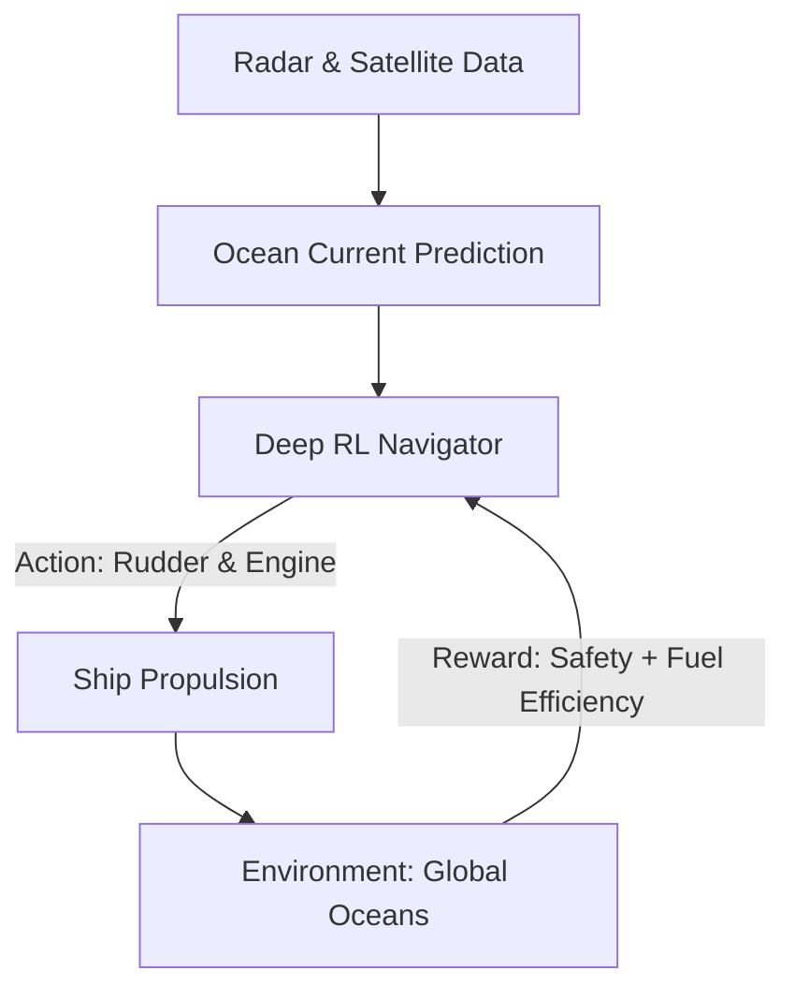

# Autonomous Ship Navigation RL

🧠 **What does this do? (The Analogy)**
Think of a **Sailor in a Storm**. The wind wants to push the ship East, the waves want to push it West, and there are massive rocks (Obstacles) in the middle. A human captain uses their "Gut Feeling" to balance the wheel. **Ship RL** uses millions of simulations to find the **Mathematically Perfect Route**. It knows exactly how to "Surf" the waves to save fuel while keeping the ship 100% safe from crashing.

🔍 **Step-by-Step Explanation:**
1. **The State**: GPS coordinates, Wind speed, Wave height, and Radar data (other ships/rocks).
2. **The Reward**: Minimizing **Fuel Consumption** while arriving at the port **On Time**.
3. **The Action**: Rudder angle and Engine RPM (Speed).
4. **Long-Horizon Planning**: Because a 200,000-ton ship takes 5 miles to stop, the RL must "Think Ahead" by 30 minutes for every single movement.

📊 **High-Level Design (HLD)**

✅ **Why use this?**
Shipping is responsible for 3% of global CO2. RL can find routes that are 10-15% more fuel-efficient than a human captain can, potentially saving millions of tons of carbon every year.

🌍 **Real-World Examples:**
1. **Rolls-Royce Intelligence Ships**: Developing fully autonomous cargo ships that cross the Atlantic without a single human on board.
2. **Port Docking AI**: Managing the extremely precise (0.1cm) movements needed to park a massive tanker in a narrow harbor.
