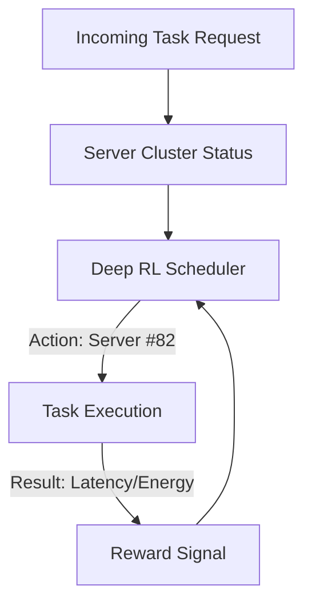

# Cloud Resource Scheduling RL

🧠 **What does this do? (The Analogy)**
Think of a **Global Hotel Chain (AWS/Google Cloud)**. Every second, thousands of guests (Tasks) arrive and want a room. Some want a small room (Python script), some want a Presidential Suite (Machine Learning training). **Cloud RL** is the "Smart Concierge." It looks at all 10,000 servers and decides exactly where to put each guest so that no server is "Overcrowded" (Lag) and no server is "Empty" (Wasted Electricity).

🔍 **Step-by-Step Explanation:**
1. **The State**: CPU, Memory, and Network usage of every server in the data center.
2. **The Reward**: Minimizing **Power Consumption** while meeting the **SLA (Service Level Agreement)** for speed.
3. **The Action**: Which specific server or "Virtual Machine" should handle the incoming task.
4. **Bin Packing**: RL is better at "Bin Packing" than humans because it can find complex patterns in traffic (e.g., "Monday mornings are always busy for Email servers").

📊 **High-Level Design (HLD)**

✅ **Why use this?**
It is the secret to **Carbon Neutrality** for big tech companies. By using RL to pack tasks efficiently, companies can turn off 10-20% of their servers, saving millions of dollars in electricity and cooling.

🌍 **Real-World Examples:**
1. **Google DeepMind Cooling**: Using RL to manage the cooling fans in Google's data centers, reducing energy usage by 40%.
2. **Serverless Computing**: Dynamically starting and stopping "Lambda" functions based on predicted traffic.
