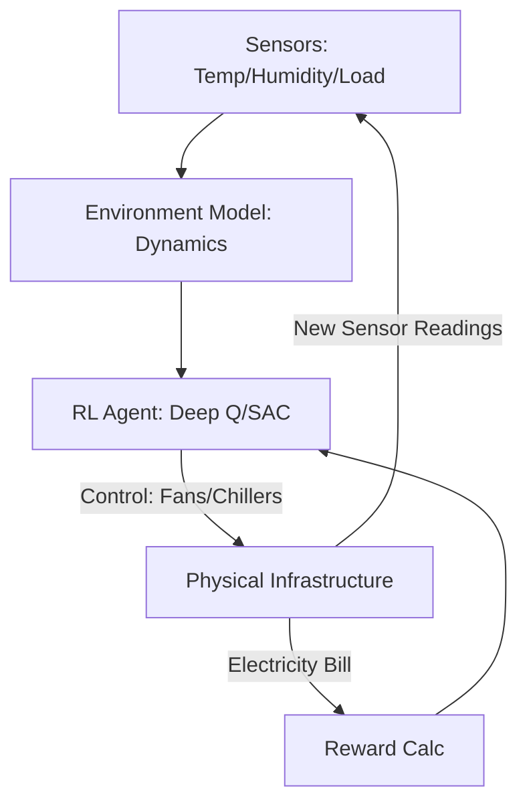

# Data Center Cooling RL

🧠 **What does this do? (The Analogy)**
Think of a **Smart Thermostat on a massive scale**. A data center has thousands of servers that get very hot. Cooling them uses a huge amount of electricity (sometimes 40% of the total bill). Standard cooling uses "Safe Rules" (e.g., fans always at 80%). **Cooling RL** is like a pro gamer who knows exactly how to keep the CPU cool while using the absolute minimum amount of power. It "plays" the cooling system to save millions of dollars in electricity.

🔍 **Step-by-Step Explanation:**
1. **State ($s_t$)**: Hundreds of sensors: CPU temperatures, outside weather, humidity, fan speeds, and server load.
2. **Action ($a_t$)**: Adjusting individual fan speeds, chiller setpoints, and air-flow valves.
3. **Reward ($r_t$)**: The **PUE** (Power Usage Effectiveness). We want the lowest possible power consumption while keeping every server below its "Red Line" temperature.
4. **Safety Constraints**: If a server overheats, the AI gets a massive penalty. It must prioritize safety over energy savings.
5. **Prediction**: The AI learns to "Predict" that a server will get hot 5 minutes before it happens, so it can start cooling early.

📊 **High-Level Design (HLD)**

✅ **Why use this?**
This is exactly what **Google** did with DeepMind. They handed over control of their data center cooling to an RL agent and instantly **reduced their cooling bill by 40%**. It is one of the most successful real-world applications of RL to date.

🌍 **Real-World Examples:**
1. **Cloud Server Farms**: Managing the heat of millions of chips while reducing the carbon footprint of companies like Microsoft or Amazon.
2. **Industrial HVAC**: Controlling the heating and cooling of a massive skyscraper or a shopping mall to maximize comfort while minimizing energy waste.
