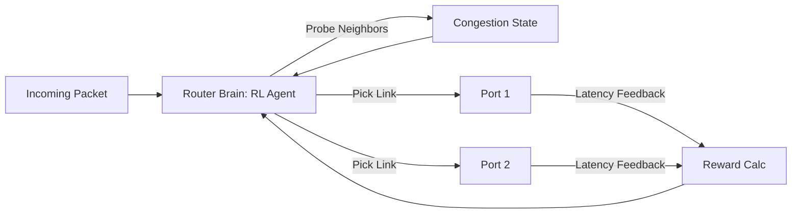

# Network Packet Routing RL

🧠 **What does this do? (The Analogy)**
Think of a **City Traffic Controller during Rush Hour**. Standard routing is like a fixed GPS that always tells everyone to take the Highway. But if the Highway gets blocked, everyone gets stuck. **Routing RL** is like a controller who sees every car (Packet) and every road (Router Link) in real-time. If a road is getting crowded, the AI immediately directs the next car to a side-street to keep the traffic moving. It makes the **Internet faster and more reliable**.

🔍 **Step-by-Step Explanation:**
1. **State ($s_t$)**: The current "Congestion" levels, Latency (delay), and Bandwidth of all connected neighbors.
2. **Action ($a_t$)**: Choosing which output link (port) to send the incoming data packet through.
3. **Reward ($r_t$)**: The **Throughput** (how much data was sent) minus the **Latency** (how long it took).
4. **Self-Healing**: If a cable is cut (link failure), the RL agent "feels" the 0 reward and immediately learns to route around the break without needing a human to re-configure the network.
5. **Quality of Service (QoS)**: The agent can learn that "Video Calls" need low delay, while "Email" can wait, prioritizing packets based on their importance.

📊 **High-Level Design (HLD)**

✅ **Why use this?**
As the world moves to 5G and massive cloud systems, networks are becoming too complex for human-written rules. RL allows the network to **Optimize itself** based on real traffic patterns, reducing buffering in videos and lag in online gaming.

🌍 **Real-World Examples:**
1. **5G Network Slicing**: Automatically giving more bandwidth to a hospital or an autonomous car while slightly slowing down a home movie download to ensure safety.
2. **Deep-Sea Cable Management**: Managing the routing of data across continents, automatically finding the fastest path through the undersea fiber-optic network.
