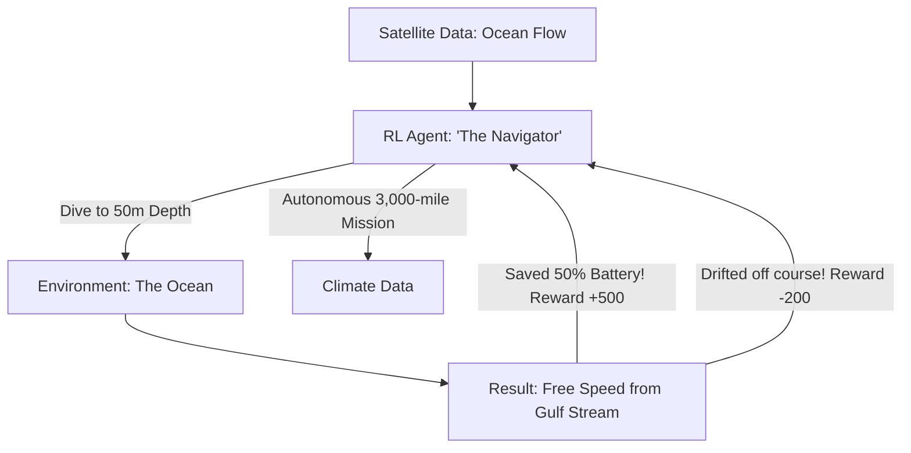

# RL for Autonomous Ocean Navigation (Long-Range AI)

🧠 **What does this do? (The Analogy)**
Think of a **Sailor trying to cross the ocean in a tiny boat with a small motor**. 
- If they use the motor all the time, they run out of gas halfway (Failure). 
- If they just float, they never get there. 
- **RL for Autonomous Ocean Navigation** is the AI that manages "Underwater Drones" and "Autonomous Ships." 
- It treats the **Ocean Currents** like a system of moving sidewalks. It looks at satellite maps of the water and says: "If I dive 100 meters down, the current is moving East. I'll stay there for 10 miles, then use my motor for 1 mile to reach the next current." 
By "Hitching a ride" on the ocean's energy, it can travel **thousands of miles** on a single charge.

🔍 **Step-by-Step Explanation:**
1. **Flow Prediction**: The AI uses a world model to predict where the currents will be in the next 24 hours.
2. **Energy Management**: The AI balances the "Cost" of using the motor vs the "Gain" of the current.
3. **Stochasticity**: The ocean is unpredictable. The AI must be **Robust** to storms and eddies.
4. **Benefit**: It is the key to **Environmental Monitoring**. We can send 1,000 "Mini-Drones" across the entire Pacific Ocean to measure plastic pollution and climate change for years without ever needing to refuel them.

📊 **High-Level Design (HLD)**

✅ **Why use this?**
It is the best choice for **Maritime Sustainability**. If we want to move global shipping toward "Net Zero," we need AI that can optimize the "Currents and Winds" for every giant cargo ship on Earth.

🌍 **Real-World Examples:**
1. **Saildrone**: Autonomous sailboats that use RL to cross the Atlantic and Pacific to monitor ocean health.
2. **Liquid Robotics (Wave Glider)**: Drones that use the motion of the waves for energy, managed by RL-based navigation.
3. **Autonomous Shipping**: Rolls-Royce and other companies developing AI-controlled "Cargo Ships" that navigate the globe with 0 crew.
