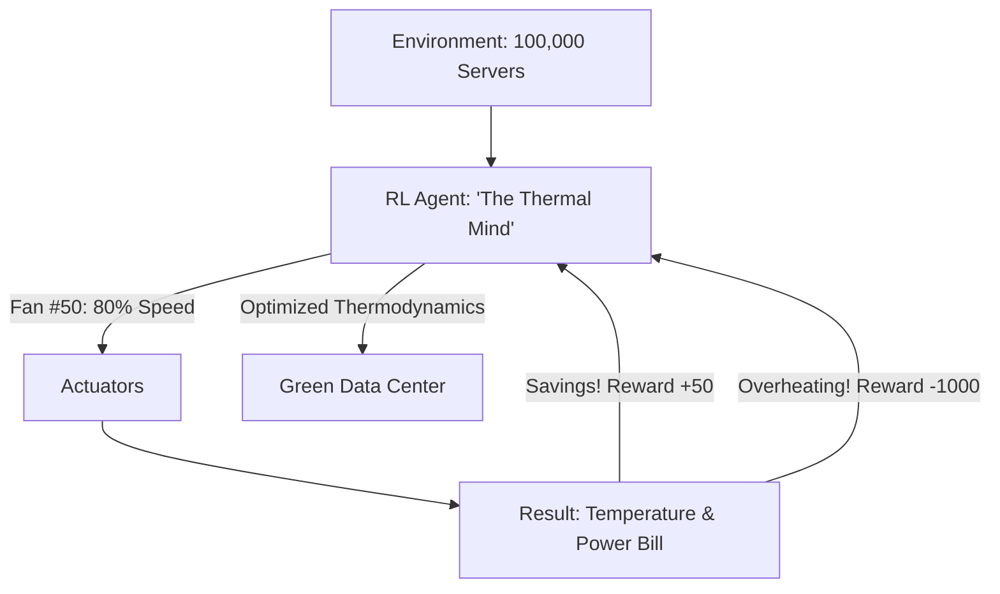

# RL for Data Center Cooling (Eco-Efficiency)

🧠 **What does this do? (The Analogy)**
Think of a **Person trying to keep a Giant House cool in the summer while using the least amount of electricity possible**. 
- They have 100 fans and 10 Air Conditioners. 
- If they turn everything on "Full Blast," the house is cold but the bill is $1,000 (Inefficient). 
- If they turn everything off, the computers in the house melt (Disaster). 
- **RL for Data Center Cooling** is the AI that manages Google's data centers. 
- It looks at the weather outside, the heat of every server, and the speed of every fan, and it constantly "tweaks" the settings to stay in the perfect "Cool but Cheap" zone. 
It reduced Google's cooling bill by **40%**—saving millions of dollars and massive amounts of CO2.

🔍 **Step-by-Step Explanation:**
1. **Sensors**: Thousands of thermometers and power meters send data to the AI every second.
2. **Control Actions**: The AI can change fan speeds, chiller temperatures, and window positions.
3. **PUE (Power Usage Effectiveness)**: The "High Score" is a PUE close to 1.0 (meaning all power goes to computers, not cooling).
4. **Safety Constraints**: If any server gets too hot, the AI gets a massive "Penalty." It learns to prioritize safety while being extremely "Stingy" with power.

📊 **High-Level Design (HLD)**

✅ **Why use this?**
It is the best choice for **Industrial Sustainability**. If you have any large-scale cooling or heating system (like a factory, a mall, or a greenhouse), RL can save more money and energy than any human engineer with a spreadsheet.

🌍 **Real-World Examples:**
1. **Google Data Centers**: The most famous application of RL in the real world.
2. **Greenhouse Climate Control**: Managing humidity and temperature for 10,000 plants to maximize growth while minimizing heater use.
3. **Smart City HVAC**: Controlling the heating/cooling of an entire university campus to balance comfort and cost.
