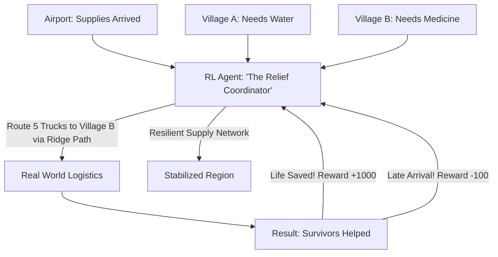

# RL for Disaster Relief Logistics (Survival Supply Chain)

🧠 **What does this do? (The Analogy)**
Think of a **Person trying to deliver 1,000 pizzas to people in a city where the bridges have fallen down**. 
- They have 10 bikes and 2 helicopters. 
- Some people are hungrier than others (Higher Priority). 
- **RL for Disaster Relief Logistics** is the AI that manages the **Red Cross or UN supply chain** after a natural disaster. 
- It looks at "Road Connectivity" maps and decides the exact path for every truck. 
- It is rewarded for **Saving Lives** and penalized if a truck gets stuck or food is wasted. 
It ensures that the right medicine reaches the right person in the middle of a chaotic emergency.

🔍 **Step-by-Step Explanation:**
1. **Dynamic Network Analysis**: The AI updates the map in real-time as roads are cleared or flooded.
2. **Priority-Based Routing**: Critical supplies (Water, Blood, Medicine) are given faster, more expensive routes.
3. **Uncertainty Management**: The AI plans "Backup Routes" in case a primary road is blocked by a landslide.
4. **Benefit**: It prevents the **Logistical Bottleneck**. After a disaster, there is usually enough food, but it gets stuck in the wrong place. RL ensures the flow never stops.

📊 **High-Level Design (HLD)**

✅ **Why use this?**
It is the best choice for **International Aid Groups**. By using RL to optimize the "First 72 Hours" of a disaster response, we can ensure that resources are not wasted and that the most vulnerable people are reached first.

🌍 **Real-World Examples:**
1. **World Food Programme (WFP)**: Using AI to optimize the delivery of grain to remote regions in South Sudan.
2. **Waze for Disaster**: RL-based apps that help relief drivers find the only open roads after a hurricane.
3. **Project OWL**: Using RL-managed "DuckLink" sensors to create a temporary internet for survivors to signal for help.
