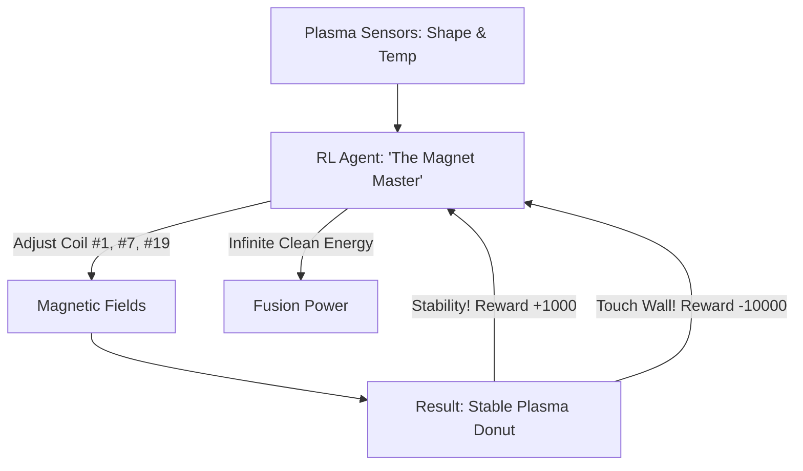

# RL for Fusion Control (Plasma Management)

🧠 **What does this do? (The Analogy)**
Think of a **Person trying to hold a Giant Blob of Jelly using 20 pairs of chopsticks**. 
- The jelly is 100 million degrees (hotter than the sun) and it wants to explode and touch the walls. 
- The chopsticks are **Magnets**. 
- To keep the jelly in a perfect "donut" shape, the person has to move all 20 pairs of chopsticks thousands of times every second. 
- **RL for Fusion Control** is the AI that manages the **Tokamak** fusion reactor. 
- It is the only way to create "Clean Energy" from water. The AI learns the complex "Wobbles" of the plasma and perfectly counters them with magnetic fields.

🔍 **Step-by-Step Explanation:**
1. **The Plasma**: A super-hot gas that is highly unstable and moves faster than a bullet.
2. **Magnetic Coils**: The only things that can "touch" the plasma without melting.
3. **High-Frequency Control**: The AI must make decisions every 100 microseconds ($10,000$ decisions per second).
4. **Benefit**: Human engineers can only design simple shapes. RL can discover "Complex Shapes" that keep the plasma alive longer, potentially leading to the first profitable fusion power plant.

📊 **High-Level Design (HLD)**

✅ **Why use this?**
It is the current **SOTA for Clean Energy**. DeepMind and the Swiss Plasma Center proved that RL is the missing piece of the puzzle for fusion. If you want to solve climate change with technology, this is the most important RL application in existence.

🌍 **Real-World Examples:**
1. **Tokamak TCV (Switzerland)**: The first reactor to be controlled entirely by a deep reinforcement learning agent.
2. **ITER (France)**: The world's largest fusion project, which plans to use AI to prevent "Disruptions" (plasma explosions).
3. **Stellarator Design**: Using RL to find the perfect "Twisted" magnetic shape to hold plasma without it leaking.
