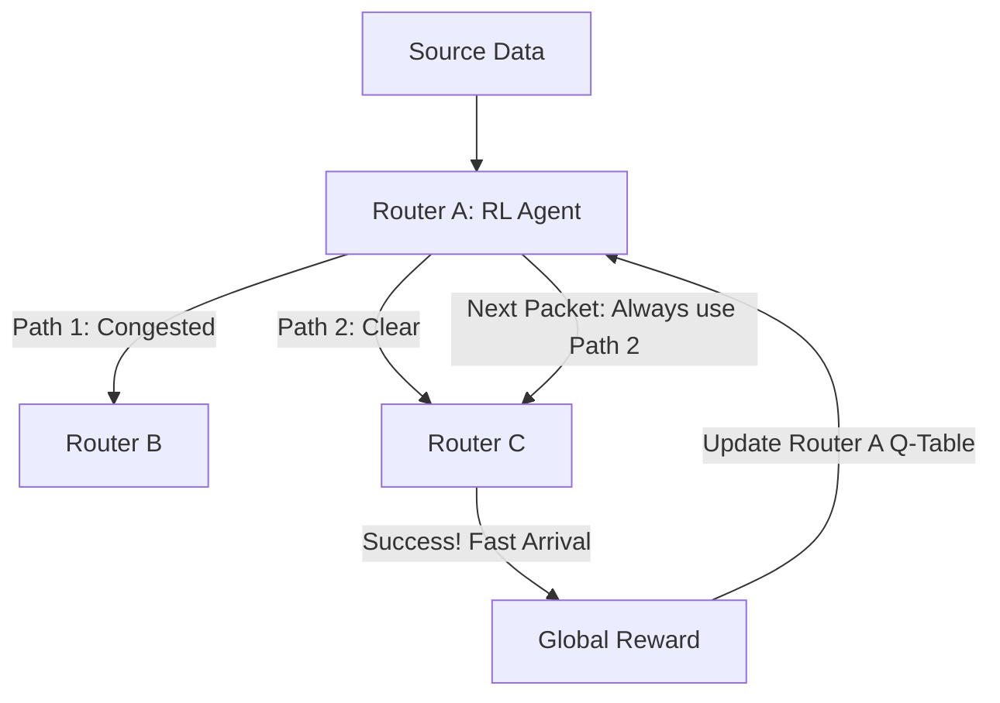

# RL for Network Packet Routing (Internet Optimization)

🧠 **What does this do? (The Analogy)**
Think of a **Person trying to send 1,000 letters through a city where the roads are constantly closing and opening**. 
- To get the letters there fast (Low Latency), the person has to pick the best street for every letter. 
- **RL for Network Packet Routing** is the AI that manages the **Internet**. 
- It looks at every "Router" (Intersection) and decides where to send the next bit of data. 
- If one router is "Congested" (A traffic jam), the AI instantly reroutes the data through a different path. 
Because the internet is too complex for human-made "If-Then" rules, RL is used to learn the **Dynamic Flow** of the world's data.

🔍 **Step-by-Step Explanation:**
1. **Dynamic Topology**: The internet changes every second. Nodes go down and new ones come up.
2. **Q-Routing**: A classic RL algorithm where every router maintains a Q-table of "How long will it take to reach the goal if I send it to Neighbor X?"
3. **Multi-Objective**: The AI must balance **Speed** (Latency) vs **Reliability** (Packet Loss).
4. **Benefit**: It makes the internet **Self-Healing**. If a fiber-optic cable is cut, the AI reroutes all data in milliseconds, so you don't even notice your video call stutter.

📊 **High-Level Design (HLD)**

✅ **Why use this?**
It is the best choice for **Modern Telecommunications**. With the rise of 5G and Space-based Internet (like Starlink), the complexity of routing is too high for humans. RL is the "Brain" that ensures your data takes the fastest possible path across the globe.

🌍 **Real-World Examples:**
1. **Cisco & Juniper Routers**: Using RL-based "Traffic Engineering" to maximize the capacity of their high-end hardware.
2. **Satellite Internet (Starlink)**: Coordinating thousands of satellites to "Hand off" data packets as they move across the sky at 17,000 mph.
3. **Netflix Content Delivery**: Using RL to decide which server (New York or London) should send a movie to a user in Ireland to ensure 4K quality.
