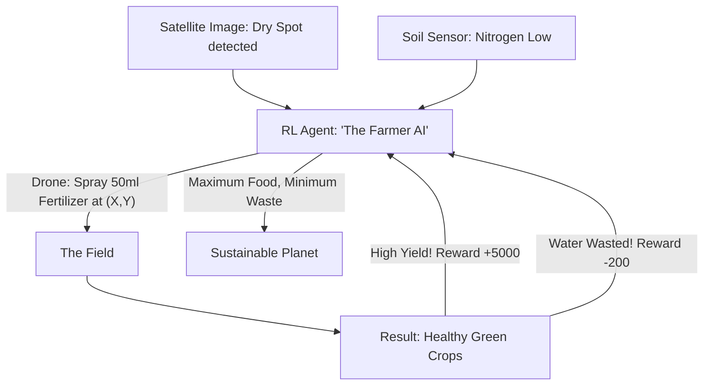

# RL for Precision Agriculture (Smart Farming)

🧠 **What does this do? (The Analogy)**
Think of a **Person managing 1,000 houseplants, but every houseplant is different**. 
- Plant A needs water every 2 days. Plant B needs water every 5 days. 
- If you water everything at once, some die and you waste water. 
- **RL for Precision Agriculture** is the AI that manages **Smart Farms**. 
- It uses sensors to measure the "Thirst" and "Hunger" of every single square meter of soil. 
- It is rewarded for a **Huge Harvest** and penalized for **Wasting Water** or using too much fertilizer. 
It allows us to grow **2x more food** using **90% less water**, which is essential for a growing planet.

🔍 **Step-by-Step Explanation:**
1. **Multimodal Sensing**: The AI looks at satellite images (NDVI), soil sensors, and weather forecasts.
2. **Variable Rate Technology (VRT)**: The AI controls tractors and sprinklers to apply different amounts of water to different parts of the field.
3. **The Reward**: Based on "Final Crop Quality" at the end of the season.
4. **Benefit**: It prevents "Fertilizer Runoff" (which kills fish in rivers) and keeps the land healthy for decades.

📊 **High-Level Design (HLD)**

✅ **Why use this?**
It is the best choice for **Vertical Farming and Large-Scale Agriculture**. As water becomes more expensive and the climate changes, RL is the only way to ensure that every drop of water is turned into a calorie of food.

🌍 **Real-World Examples:**
1. **Iron Ox**: An autonomous vertical farm where RL-managed robots handle every stage of a plant's life.
2. **John Deere (See & Spray)**: Tractors that use AI to identify and spray only the "Weeds," leaving the "Crops" alone, reducing chemical use by 80%.
3. **Microsoft FarmBeats**: An RL-based system that helps small-scale farmers in India and Africa optimize their water use using cheap sensors.
