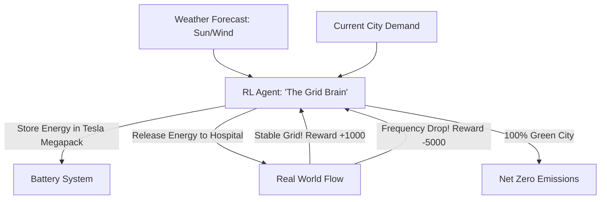

# RL for Renewable Energy Grid (Green Transition)

🧠 **What does this do? (The Analogy)**
Think of a **Person managing a giant Battery for a city**. 
- The city has **Solar Panels** (only work when sunny) and **Wind Turbines** (only work when windy). 
- The people in the city want electricity **all the time**. 
- **RL for Renewable Energy Grid** is the AI that manages the **Smart Grid**. 
- It looks at the weather forecast and says: "The wind is going to stop in 2 hours, but it's very sunny now. I will fill the giant batteries **now** so I can keep the lights on later." 
It solves the "Intermittency" problem of green energy, allowing a city to run on **100% renewables** without any blackouts.

🔍 **Step-by-Step Explanation:**
1. **Unpredictable Supply**: Solar and wind energy change every minute.
2. **Dynamic Demand**: People use more power at 6 PM (dinner) than at 3 AM.
3. **The Battery Controller**: The AI decides every minute: "Should I Charge, Discharge, or Hold?"
4. **Benefit**: It prevents the need for "Gas Backup Plants." By being smarter with batteries, we can turn off the coal and gas plants forever.

📊 **High-Level Design (HLD)**

✅ **Why use this?**
It is the gold standard for **Modern Utilities**. As we add more electric cars and solar panels to the world, the grid becomes too complex for humans to manage. RL is the "Autonomous Pilot" for the world's energy system.

🌍 **Real-World Examples:**
1. **Google & DeepMind Wind Power**: Using RL to predict wind output 36 hours in advance, making wind energy 20% more valuable.
2. **Tesla Autobidder**: An RL-based system that manages giant batteries (like the one in South Australia) to trade energy and stabilize the grid.
3. **California ISO**: Experimenting with AI to manage the "Duck Curve" (the massive swing in solar energy during sunset).
